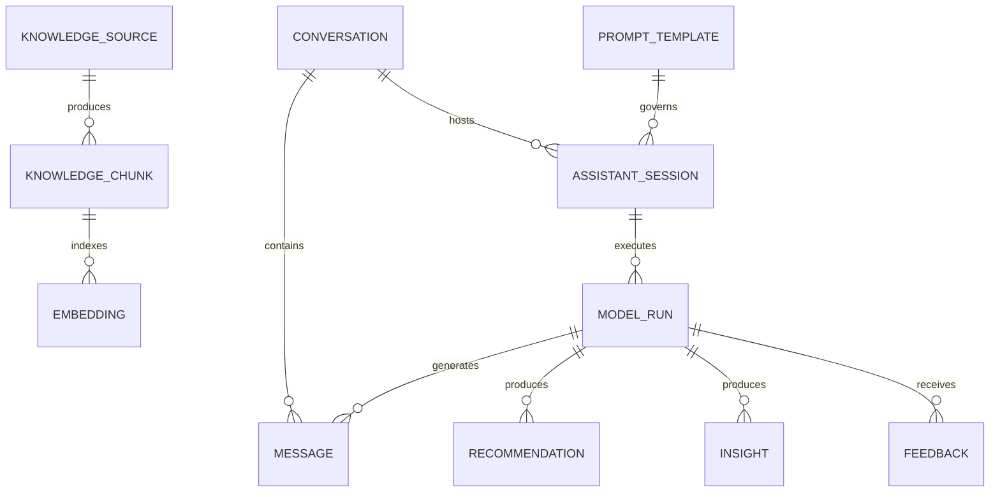
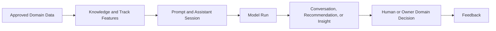

# MIỀN NGHIỆP VỤ AI

Document Path: database/ai/README.md

> ⚠️ **Chưa triển khai**: Đây là spec kiến trúc đã duyệt (ADR-0006, Frozen)
> nhưng hiện chưa có migration/model thực tế trong codebase — xem
> `database/migrations/` để biết trạng thái triển khai thật.

Miền nghiệp vụ AI chuyển đổi ngữ cảnh học tập, hành vi và bằng chứng đã được
phê duyệt thành các chức năng trợ giúp và hỗ trợ ra quyết định có thể kiểm
chứng. Miền nghiệp vụ này quản lý tri thức AI, hội thoại, đề xuất, thông tin
chuyên sâu, nguồn gốc thực thi, phản hồi và quản trị prompt mà không trở thành
đơn vị có thẩm quyền đối với trạng thái của miền nghiệp vụ khác.

---

## Tổng quan Miền nghiệp vụ

- **Trách nhiệm nghiệp vụ:** Cung cấp trải nghiệm AI được quản trị và đầu ra có
  thể giải thích cho học viên, giáo viên và quản trị viên.
- **Phạm vi:** Truy xuất tri thức, hội thoại, điều phối trợ lý, kiểm tra việc
  thực thi mô hình, đề xuất, thông tin chuyên sâu, phản hồi và prompt.
- **Sở hữu:** Đăng ký AI và tri thức dẫn xuất, tương tác AI, đầu ra AI và nguồn
  gốc thực thi AI.
- **Không sở hữu:** Progress hoặc Hoàn thành khóa học, kết quả Assessment,
  dữ liệu tham dự, xử lý Media, Certificate, Thanh toán, Entitlement hoặc hành
  vi Track.
- **Miền nghiệp vụ liên quan:** Course, Assessment, LiveClass, Media, Track,
  Tenant, Commercial, Usage và Billing.

---

## Các nhóm cơ sở dữ liệu

## 1. Tri thức và truy xuất

| Bảng | Mô tả |
|------|------|
| **ai_knowledge_sources** | Đăng ký nguồn tri thức đã được phê duyệt |
| **ai_knowledge_chunks** | Các phân đoạn tri thức sẵn sàng để truy xuất |
| **ai_embeddings** | Metadata của embedding và tham chiếu đến kho vector |

---

## 2. Hội thoại và hỗ trợ

| Bảng | Mô tả |
|------|------|
| **ai_conversations** | Vùng chứa hội thoại giữa người dùng và trợ lý |
| **ai_messages** | Các thông điệp hội thoại theo thứ tự |
| **ai_assistant_sessions** | Phiên điều phối trợ lý tại thời gian chạy |

---

## 3. Vận hành mô hình và quản trị prompt

| Bảng | Mô tả |
|------|------|
| **ai_prompt_templates** | Các Prompt Template được quản trị |
| **ai_model_runs** | Kiểm tra và nguồn gốc thực thi mô hình |

---

## 4. Hỗ trợ ra quyết định

| Bảng | Mô tả |
|------|------|
| **ai_recommendations** | Các đề xuất AI có thể giải thích |
| **ai_insights** | Các quan sát và thông tin chuyên sâu AI có thể giải thích |

---

## 5. Phản hồi

| Bảng | Mô tả |
|------|------|
| **ai_feedback** | Phản hồi của người dùng và người đánh giá về đầu ra AI |

---

## Sơ đồ quan hệ Miền nghiệp vụ

---

## Luồng nghiệp vụ

---

## Quan hệ liên Miền nghiệp vụ

AI → Tenant để bảo đảm cô lập và cung cấp ngữ cảnh được cấp quyền  
AI → Course để lấy ngữ cảnh học tập đã phát hành  
AI → Assessment để lấy bằng chứng đánh giá  
AI → LiveClass để lấy bằng chứng vận hành được cấp quyền  
AI → Media để sử dụng tài sản số và bản ghi lời thoại  
AI → Track để lấy tổng hợp hành vi và các đặc trưng sẵn sàng cho AI  
AI → Learning (Proposed, chưa duyệt) để đọc Mastery Profile cho Recommendation/Insight  
AI → Commercial để kiểm tra Entitlement đối với tính năng  
AI → Usage để ghi nhận các phép đo mức tiêu thụ tài nguyên đã được phê duyệt

---

## Proposed Learning Integration (Chưa có hiệu lực)

> ⚠️ **Proposed, chưa được duyệt**: Mục này mô tả Amendment Version 1.1 đề
> xuất của [ADR-0006](../../adr/ADR-0006-AI-Foundation.md). Chưa có hiệu lực
> cho tới khi Architecture Owner ghi `Approved` vào khối Owner Approval của
> ADR-0006, và Learning Foundation
> ([ADR-0016](../../adr/ADR-0016-Learning-Foundation.md)) hoàn tất Phase 4
> authorization/implementation riêng.

* Learning Mastery Profile (`core_learning_mastery_profiles`) là structured
  read-model input cho Recommendation/Insight, không phải Knowledge/RAG
  source.
* Không đăng ký vào `ai_knowledge_sources`; không chunk, không embed.
* Chưa có hiệu lực trước Owner Approval (ADR-0006) và trước khi Learning
  Foundation hoàn tất Phase 4.

---

## Nguyên tắc thiết kế

- AI là miền nghiệp vụ tiêu thụ dữ liệu và hỗ trợ ra quyết định.
- Các miền nghiệp vụ sở hữu vẫn có thẩm quyền đối với trạng thái nghiệp vụ của
  mình.
- Việc đăng ký tri thức không chuyển quyền sở hữu nội dung nguồn.
- Chunk và embedding là dữ liệu dẫn xuất có thể tái tạo.
- Mọi lần thực thi mô hình đều có thể kiểm tra thông qua thông tin nguồn gốc.
- Prompt Template được quản trị và quản lý theo phiên bản.
- Đề xuất và thông tin chuyên sâu phải có khả năng giải thích.
- Đầu ra AI không bao giờ trực tiếp hoàn thành, chấm điểm, cấp phát, thanh toán
  hoặc cấp quyền.
- Ngữ cảnh và hoạt động truy xuất của AI luôn được cô lập theo tenant.
