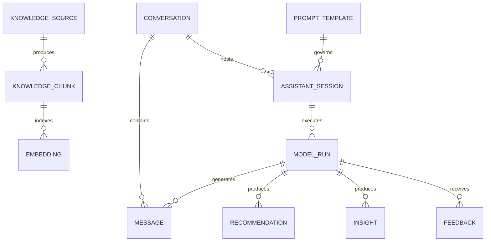
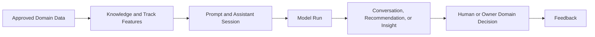

# DOMAIN AI

Domain AI chuyển đổi ngữ cảnh học tập, hành vi và bằng chứng đã được phê duyệt
thành các chức năng hỗ trợ và hỗ trợ ra quyết định có thể kiểm tra. Domain này
quản lý tri thức AI, hội thoại, đề xuất, insight, nguồn gốc thực thi, phản hồi
và quản trị prompt mà không trở thành nơi có thẩm quyền đối với trạng thái của
Domain khác.

---

## Tổng quan Domain

- **Trách nhiệm nghiệp vụ:** Cung cấp trải nghiệm AI được quản trị và đầu ra có
  thể giải thích cho học viên, giáo viên và quản trị viên.
- **Phạm vi:** Truy xuất tri thức, hội thoại, điều phối trợ lý, kiểm tra việc
  thực thi model, đề xuất, insight, phản hồi và prompt.
- **Sở hữu:** Đăng ký AI và tri thức dẫn xuất, tương tác AI, đầu ra AI và nguồn
  gốc thực thi AI.
- **Không sở hữu:** Course Progress hoặc Completion, kết quả Assessment,
  Attendance, xử lý Media, Certificate, Payment, Entitlement hoặc hành vi
  Track.
- **Domain liên quan:** Course, Assessment, LiveClass, Media, Track, Tenant,
  Commercial, Usage và Billing.

---

## Các nhóm cơ sở dữ liệu

## 1. Tri thức và truy xuất

| Table | Mô tả |
|------|------|
| ai_knowledge_sources | Đăng ký nguồn tri thức đã được phê duyệt |
| ai_knowledge_chunks | Các phân đoạn tri thức sẵn sàng để truy xuất |
| ai_embeddings | Metadata embedding và tham chiếu đến kho vector |

---

## 2. Hội thoại và hỗ trợ

| Table | Mô tả |
|------|------|
| ai_conversations | Container hội thoại giữa User và trợ lý |
| ai_messages | Các message hội thoại theo thứ tự |
| ai_assistant_sessions | Phiên điều phối trợ lý tại runtime |

---

## 3. Vận hành model và quản trị prompt

| Table | Mô tả |
|------|------|
| ai_prompt_templates | Các Prompt Template được quản trị |
| ai_model_runs | Kiểm tra và nguồn gốc thực thi model |

---

## 4. Hỗ trợ ra quyết định

| Table | Mô tả |
|------|------|
| ai_recommendations | Các đề xuất AI có thể giải thích |
| ai_insights | Các quan sát và insight AI có thể giải thích |

---

## 5. Phản hồi

| Table | Mô tả |
|------|------|
| ai_feedback | Phản hồi của User và người đánh giá về đầu ra AI |

---

## Sơ đồ quan hệ Domain

---

## Luồng nghiệp vụ

---

## Quan hệ liên Domain

AI → Tenant để bảo đảm cô lập và cung cấp ngữ cảnh được cấp quyền  
AI → Course để lấy ngữ cảnh học tập đã publish  
AI → Assessment để lấy bằng chứng đánh giá  
AI → LiveClass để lấy bằng chứng vận hành được cấp quyền  
AI → Media để sử dụng asset và transcript  
AI → Track để lấy tổng hợp hành vi và các feature sẵn sàng cho AI  
AI → Commercial để kiểm tra Entitlement đối với capability  
AI → Usage để ghi nhận các phép đo mức tiêu thụ tài nguyên đã được phê duyệt

---

## Nguyên tắc thiết kế

- AI là Domain tiêu thụ dữ liệu và hỗ trợ ra quyết định.
- Các Domain sở hữu vẫn có thẩm quyền đối với trạng thái nghiệp vụ của mình.
- Việc đăng ký tri thức không chuyển quyền sở hữu nội dung nguồn.
- Chunk và embedding là dữ liệu dẫn xuất có thể tái tạo.
- Mọi lần thực thi model đều có thể kiểm tra thông qua thông tin nguồn gốc.
- Prompt Template được quản trị và version hóa.
- Recommendation và insight phải có khả năng giải thích.
- Đầu ra AI không bao giờ trực tiếp hoàn thành, chấm điểm, cấp phát, thanh toán
  hoặc cấp quyền.
- Ngữ cảnh và hoạt động truy xuất của AI luôn được cô lập theo tenant.
