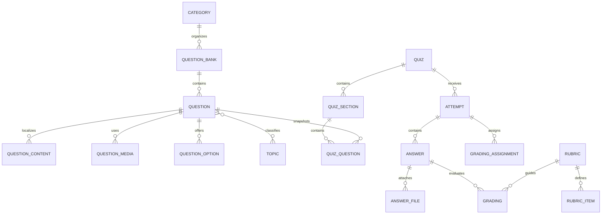
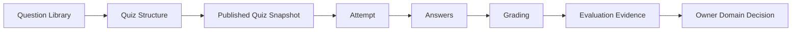

# MIỀN NGHIỆP VỤ ASSESSMENT

> ⚠️ **Chưa triển khai**: Đây là spec kiến trúc đã duyệt (ADR-0003, Approved)
> nhưng hiện chưa có migration/model thực tế trong codebase — xem
> `database/migrations/` để biết trạng thái triển khai thật.

Miền nghiệp vụ Assessment quản lý việc biên soạn câu hỏi và toàn bộ chu trình
đánh giá, từ bài kiểm tra đã phát hành đến lần làm bài, câu trả lời, chấm điểm
và phản hồi. Miền nghiệp vụ này tạo ra bằng chứng đánh giá, đồng thời để các
quyết định về Progress, Hoàn thành khóa học và Certificate cho các miền
nghiệp vụ sở hữu tương ứng.

---

## Tổng quan Miền nghiệp vụ

- **Trách nhiệm nghiệp vụ:** Đo lường kết quả học tập và lưu giữ bằng chứng đánh
  giá đáng tin cậy.
- **Phạm vi:** Thư viện câu hỏi, Snapshot bài kiểm tra, lần làm bài,
  câu trả lời, chấm điểm, rubric, điểm số, kết quả đạt/không đạt và phản hồi.
- **Sở hữu:** Nguồn biên soạn Assessment, Snapshot Assessment đã phát hành,
  bài làm của học viên và kết quả chấm điểm.
- **Không sở hữu:** Progress hoặc Hoàn thành khóa học, điều kiện cấp
  Certificate, tệp Media, hành vi Track hoặc quyết định cuối cùng thuộc miền
  nghiệp vụ khác.
- **Miền nghiệp vụ liên quan:** Course, Certificate, Media, Track, AI, Người
  dùng và Tenant.

---

## Các nhóm cơ sở dữ liệu

## 1. Thư viện câu hỏi và hệ thống phân loại

| Bảng | Mô tả |
|------|------|
| **core_assessment_categories** | Cây phân cấp danh mục Assessment |
| **core_assessment_question_banks** | Các ngân hàng câu hỏi có thể tái sử dụng |
| **core_assessment_questions** | Nguồn biên soạn câu hỏi |
| **core_assessment_question_contents** | Nội dung câu hỏi được bản địa hóa |
| **core_assessment_question_media** | Media đính kèm câu hỏi |
| **core_assessment_question_options** | Các lựa chọn và phương án đúng/sai |
| **core_assessment_topics** | Cây phân cấp chủ đề của câu hỏi |
| **core_assessment_question_topics** | Quan hệ gán câu hỏi với chủ đề |

---

## 2. Cấu trúc bài kiểm tra đã phát hành

| Bảng | Mô tả |
|------|------|
| **core_assessment_quizzes** | Các đối tượng Assessment đã phát hành |
| **core_assessment_quiz_sections** | Các phần của bài kiểm tra |
| **core_assessment_quiz_questions** | Snapshot câu hỏi trong bài kiểm tra đã được đóng băng |

---

## 3. Lần làm bài và câu trả lời

| Bảng | Mô tả |
|------|------|
| **core_assessment_attempts** | Các lần học viên thực hiện bài kiểm tra |
| **core_assessment_answers** | Các câu trả lời trong một lần làm bài |
| **core_assessment_answer_files** | Media đính kèm câu trả lời |

---

## 4. Vận hành chấm điểm

| Bảng | Mô tả |
|------|------|
| **core_assessment_grading_assignments** | Phân công công việc chấm điểm |
| **core_assessment_gradings** | Bằng chứng chấm điểm và kết quả cuối cùng |

---

## 5. Rubric

| Bảng | Mô tả |
|------|------|
| **core_assessment_rubrics** | Các Rubric chấm điểm có thể tái sử dụng |
| **core_assessment_rubric_items** | Các tiêu chí trong Rubric |

---

## Sơ đồ quan hệ Miền nghiệp vụ

---

## Luồng nghiệp vụ

---

## Quan hệ liên Miền nghiệp vụ

Assessment → Tenant để bảo đảm cô lập  
Assessment → User cho tác giả, học viên và người chấm  
Assessment → Course để lấy Version Activity bất biến và ngữ cảnh Enrollment  
Assessment → Media để sử dụng tài sản số của câu hỏi và câu trả lời  
Assessment → AI để nhận đề xuất chấm điểm tùy chọn  
Assessment → Track để phát sinh Event hành vi  
Assessment → Certificate để cung cấp bằng chứng đánh giá

---

## Nguyên tắc thiết kế

- Assessment là nơi có thẩm quyền đối với bằng chứng đánh giá.
- Quá trình biên soạn câu hỏi và Snapshot bài kiểm tra đã phát hành có
  vòng đời riêng.
- Lần làm bài hiện có luôn giữ nguyên ngữ cảnh bài kiểm tra đã được đóng băng.
- Mỗi lần làm bài thuộc một chu trình Enrollment.
- Câu trả lời thuộc lần làm bài và câu hỏi trong bài kiểm tra đã được đóng băng.
- Tệp Media vẫn thuộc quyền sở hữu dữ liệu của Miền nghiệp vụ Media.
- Chấm điểm bằng AI chỉ là đề xuất, không bao giờ tự trở thành thẩm quyền cuối cùng.
- Tiêu chí và kết quả Rubric bảo toàn lịch sử chấm điểm.
- Bằng chứng Assessment không bao giờ trực tiếp thay đổi trạng thái Course hoặc
  Certificate.
- Mọi dữ liệu nghiệp vụ Assessment đều được cô lập theo tenant.
