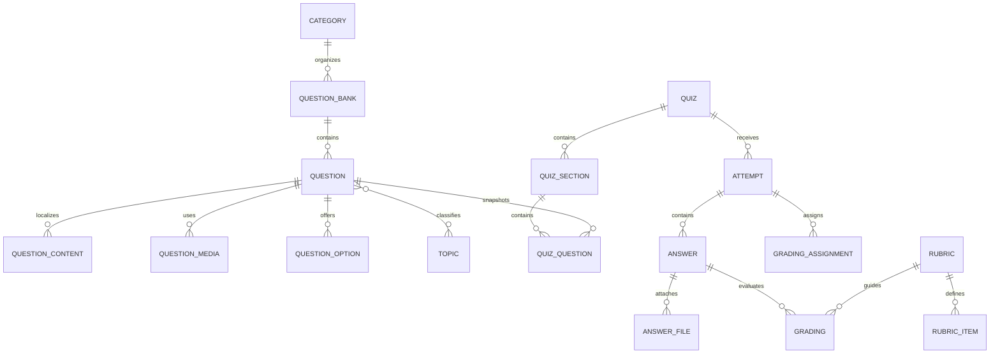
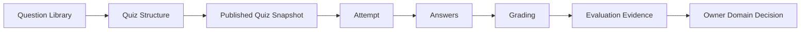

# DOMAIN ASSESSMENT

Domain Assessment quản lý việc biên soạn câu hỏi và toàn bộ chu trình đánh giá,
từ Quiz đã publish đến Attempt, Answer, Grading và Feedback. Domain này tạo ra
bằng chứng đánh giá, đồng thời để quyết định về Progress, Completion và
Certificate cho các Domain sở hữu tương ứng.

---

## Tổng quan Domain

- **Trách nhiệm nghiệp vụ:** Đo lường kết quả học tập và lưu giữ bằng chứng đánh
  giá đáng tin cậy.
- **Phạm vi:** Thư viện câu hỏi, snapshot Quiz, Attempt, Answer, Grading,
  Rubric, điểm số, kết quả đạt/không đạt và Feedback.
- **Sở hữu:** Nguồn biên soạn Assessment, snapshot Assessment đã publish, bài
  làm của học viên và kết quả Grading.
- **Không sở hữu:** Course Progress hoặc Completion, điều kiện cấp Certificate,
  file Media, hành vi Track hoặc quyết định cuối cùng thuộc Domain khác.
- **Domain liên quan:** Course, Certificate, Media, Track, AI, User và Tenant.

---

## Các nhóm cơ sở dữ liệu

## 1. Thư viện câu hỏi và hệ thống phân loại

| Table | Mô tả |
|------|------|
| core_assessment_categories | Cây phân cấp danh mục Assessment |
| core_assessment_question_banks | Các Question Bank có thể tái sử dụng |
| core_assessment_questions | Nguồn biên soạn Question |
| core_assessment_question_contents | Nội dung Question được bản địa hóa |
| core_assessment_question_media | Media đính kèm Question |
| core_assessment_question_options | Các lựa chọn và phương án đúng/sai |
| core_assessment_topics | Cây phân cấp Topic của Question |
| core_assessment_question_topics | Quan hệ gán Question với Topic |

---

## 2. Cấu trúc Quiz đã publish

| Table | Mô tả |
|------|------|
| core_assessment_quizzes | Các đối tượng Assessment đã publish |
| core_assessment_quiz_sections | Các Section của Quiz |
| core_assessment_quiz_questions | Snapshot Question trong Quiz đã được đóng băng |

---

## 3. Attempt và Answer

| Table | Mô tả |
|------|------|
| core_assessment_attempts | Các lần học viên thực hiện Quiz |
| core_assessment_answers | Các Answer trong một Attempt |
| core_assessment_answer_files | Media đính kèm Answer |

---

## 4. Vận hành chấm điểm

| Table | Mô tả |
|------|------|
| core_assessment_grading_assignments | Phân công công việc Grading |
| core_assessment_gradings | Bằng chứng Grading và kết quả cuối cùng |

---

## 5. Rubric

| Table | Mô tả |
|------|------|
| core_assessment_rubrics | Các Rubric chấm điểm có thể tái sử dụng |
| core_assessment_rubric_items | Các tiêu chí trong Rubric |

---

## Sơ đồ quan hệ Domain

---

## Luồng nghiệp vụ

---

## Quan hệ liên Domain

Assessment → Tenant để bảo đảm cô lập  
Assessment → User cho tác giả, học viên và người chấm  
Assessment → Course để lấy Version Activity bất biến và ngữ cảnh Enrollment  
Assessment → Media để sử dụng asset của Question và Answer  
Assessment → AI để nhận đề xuất Grading tùy chọn  
Assessment → Track để phát sinh sự kiện hành vi  
Assessment → Certificate để cung cấp bằng chứng đánh giá

---

## Nguyên tắc thiết kế

- Assessment là nơi có thẩm quyền đối với bằng chứng đánh giá.
- Quá trình biên soạn Question và snapshot Quiz đã publish có lifecycle riêng.
- Attempt hiện có luôn giữ nguyên ngữ cảnh Quiz đã được đóng băng.
- Mỗi Attempt thuộc một chu trình học Enrollment.
- Answer thuộc Attempt và Question trong Quiz đã được đóng băng.
- File Media vẫn thuộc quyền sở hữu của Domain Media.
- Grading bằng AI chỉ là đề xuất, không bao giờ tự trở thành thẩm quyền cuối cùng.
- Tiêu chí và kết quả Rubric bảo toàn lịch sử chấm điểm.
- Bằng chứng Assessment không bao giờ trực tiếp thay đổi trạng thái Course hoặc
  Certificate.
- Mọi dữ liệu nghiệp vụ Assessment đều được cô lập theo tenant.
