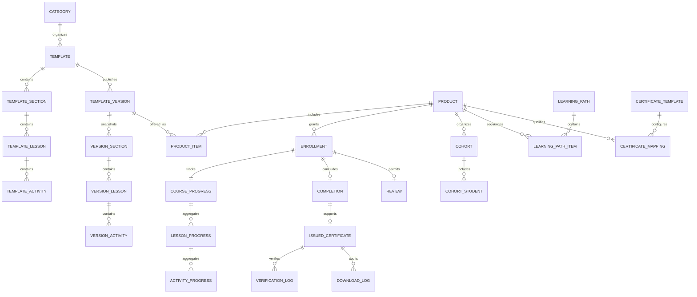
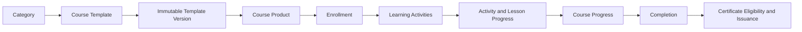

# DOMAIN COURSE

Domain Course quản lý lifecycle học tập từ khâu biên soạn và publish bất biến
đến Product, Enrollment, Progress và Completion. Vì lý do lịch sử, thư mục này
đồng thời chứa dữ liệu persistence của Certificate; Certificate vẫn là một
Domain sở hữu độc lập và được xác định rõ bên dưới.

---

## Tổng quan Domain

- **Trách nhiệm nghiệp vụ:** Định nghĩa, publish, cung cấp, triển khai và hoàn
  thành các trải nghiệm học tập có version.
- **Phạm vi:** Catalog và biên soạn Course, các Version bất biến, Product, chu
  trình Enrollment, Cohort, Progress của học viên, tương tác, Learning Path và
  Completion.
- **Sở hữu:** Course Template và Version, liên kết học tập của Product,
  Enrollment, Course Progress và Course Completion.
- **Không sở hữu:** Kết quả Assessment, hoạt động LiveClass, asset Media, hành
  vi Track, đầu ra AI hoặc điều kiện và việc cấp Certificate.
- **Domain liên quan:** Tenant, User, Assessment, LiveClass, Media, Track, AI
  và Certificate.
- **Ranh giới đồng vị trí:** Các bảng `core_certificate_*` trong thư mục này
  thuộc Domain Certificate, không thuộc Domain Course.

---

## Các nhóm cơ sở dữ liệu

## 1. Catalog và biên soạn Course

| Table | Mô tả |
|------|------|
| core_course_categories | Danh mục trong Catalog Course |
| core_course_templates | Blueprint Course có thể chỉnh sửa |
| core_course_template_teachers | Giáo viên được phân công cho blueprint Course |
| core_course_template_sections | Section Course có thể chỉnh sửa |
| core_course_template_lessons | Lesson có thể chỉnh sửa |
| core_course_template_activities | Activity học tập có thể chỉnh sửa |

---

## 2. Version Course đã publish

| Table | Mô tả |
|------|------|
| core_course_template_versions | Snapshot Course đã publish và bất biến |
| core_course_template_version_sections | Snapshot Section đã publish |
| core_course_template_version_lessons | Snapshot Lesson đã publish |
| core_course_template_version_activities | Snapshot Activity đã publish |

---

## 3. Course Product

| Table | Mô tả |
|------|------|
| core_course_products | Sản phẩm Course được hiển thị hoặc cấp cho học viên |
| core_course_product_items | Các Version đã publish được đưa vào Product |
| core_course_product_relations | Quan hệ giữa các Product |

---

## 4. Enrollment và Cohort

| Table | Mô tả |
|------|------|
| core_course_enrollments | Quyền truy cập và chu trình học của học viên |
| core_course_cohorts | Lớp học và nhóm học vận hành thực tế |
| core_course_cohort_students | Quan hệ thành viên của học viên trong Cohort |

---

## 5. Learning Progress và Completion

| Table | Mô tả |
|------|------|
| core_course_progress | Progress học tập cấp Product |
| core_course_lesson_progress | Progress học tập cấp Lesson |
| core_course_activity_progress | Progress học tập cấp Activity |
| core_course_completions | Kết quả hoàn thành Course chính thức |

---

## 6. Tương tác của học viên

| Table | Mô tả |
|------|------|
| core_course_notes | Ghi chú học tập cá nhân |
| core_course_bookmarks | Vị trí và nội dung học tập đã lưu |
| core_course_favorites | Course Product được học viên lưu yêu thích |
| core_course_reviews | Đánh giá Product dựa trên Enrollment |

---

## 7. Learning Path học thuật

| Table | Mô tả |
|------|------|
| core_course_learning_paths | Lộ trình học thuật có thứ tự |
| core_course_learning_path_items | Các Product được sắp xếp trong Learning Path |

---

## 8. Chính sách và bằng chứng Certificate — Domain Certificate

| Table | Mô tả |
|------|------|
| core_certificate_templates | Thiết kế Certificate của tenant |
| core_certificate_template_products | Rule và mapping Certificate theo Product |
| core_certificate_issued_certificates | Bằng chứng Certificate đã cấp và bất biến |
| core_certificate_verification_logs | Lịch sử kiểm tra xác thực Certificate |
| core_certificate_download_logs | Lịch sử truy cập và tải Certificate |

---

## Sơ đồ quan hệ Domain

---

## Luồng nghiệp vụ

---

## Quan hệ liên Domain

Course → Tenant để bảo đảm cô lập  
Course → User cho giáo viên và học viên  
Course → Media để sử dụng các asset học tập có thể tái sử dụng  
Course → Assessment để lấy bằng chứng đánh giá  
Course → LiveClass để lấy bằng chứng Attendance và Replay  
Course → Track để phát sinh sự kiện hành vi và lấy các bản tổng hợp đã phê duyệt  
Course → AI để cung cấp ngữ cảnh học tập và nhận hỗ trợ ra quyết định  
Course → Certificate bằng cách cung cấp Completion và ngữ cảnh học tập  
Certificate → Media để lưu asset Certificate đã render

---

## Nguyên tắc thiết kế

- Course Template là nguồn định nghĩa Course có thể chỉnh sửa.
- Việc publish tạo ra một Template Version bất biến.
- Product chứa Version đã publish, không bao giờ chứa Template đang biên soạn.
- Enrollment là một chu trình học và khóa Version tương ứng.
- Việc cập nhật Product không bao giờ âm thầm chuyển đổi Enrollment hiện có.
- Progress tham chiếu đến Lesson và Activity đã publish.
- Course sở hữu các quyết định về Progress và Completion.
- Assessment và LiveClass cung cấp bằng chứng thay vì ghi trực tiếp trạng thái
  Course.
- Learning Path là cấu trúc học thuật, không phải Product hoặc Bundle.
- Certificate đã cấp vẫn là bằng chứng lịch sử bất biến do Certificate sở hữu.
