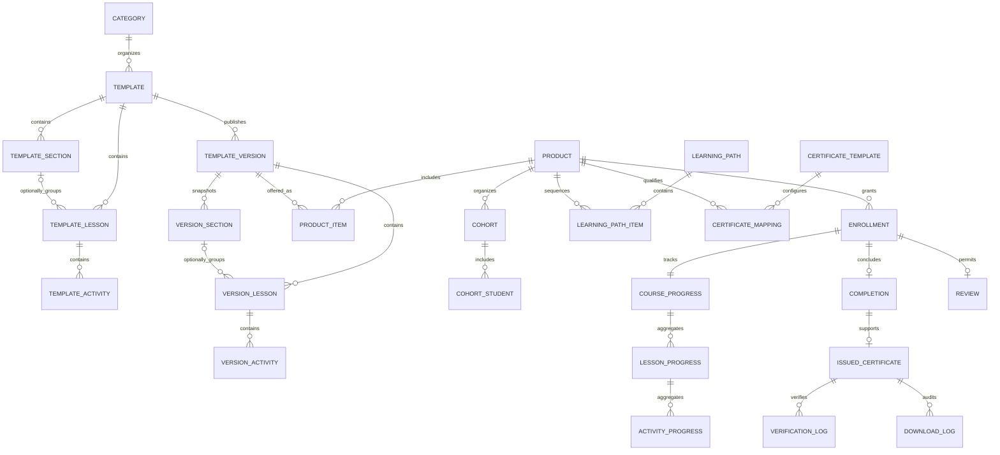
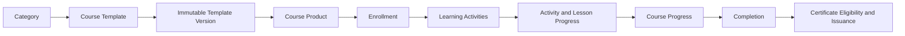

# MIỀN NGHIỆP VỤ COURSE

## Product v2 approved phase-one contracts

These contracts are approved and frozen for the Product v2 phase-one
implementation authorized by ADR-0014 and the integrated architecture review:

* [core_course_products v2 contract](core_course_products_v2_proposal.md)
* [core_course_product_items v2 contract](core_course_product_items_v2_proposal.md)

Miền nghiệp vụ Course quản lý vòng đời học tập từ khâu biên soạn và phát hành
bất biến đến Product, Enrollment, Progress và Hoàn thành khóa học. Vì lý
do lịch sử, thư mục này đồng thời chứa dữ liệu lưu trữ của Certificate; Certificate
vẫn là một miền nghiệp vụ sở hữu độc lập và được xác định rõ bên dưới.

---

## Tổng quan Miền nghiệp vụ

- **Trách nhiệm nghiệp vụ:** Định nghĩa, phát hành, cung cấp, triển khai và hoàn
  tất các trải nghiệm học tập có Version.
- **Phạm vi:** Danh mục và biên soạn Course, các Version bất biến, Product,
  chu trình Enrollment, Cohort, Progress của học viên, tương tác, Lộ trình
  học tập và Hoàn thành khóa học.
- **Sở hữu:** Template Course và Version, liên kết học tập của Sản
  phẩm, Enrollment, Progress và Hoàn thành khóa học.
- **Không sở hữu:** Kết quả Assessment, hoạt động LiveClass, tài sản số Media,
  hành vi Track, đầu ra AI hoặc điều kiện và việc cấp Certificate.
- **Miền nghiệp vụ liên quan:** Tenant, User, Assessment, LiveClass, Media,
  Track, AI và Certificate.
- **Ranh giới đồng vị trí:** Các bảng `core_certificate_*` trong thư mục này
  thuộc Miền nghiệp vụ Certificate, không thuộc Miền nghiệp vụ Course.

---

## Các nhóm cơ sở dữ liệu

## 1. Danh mục và biên soạn Course

| Bảng | Mô tả |
|------|------|
| **core_course_categories** | Danh mục trong Danh mục Course |
| **core_course_templates** | Blueprint (Thiết kế gốc) Course có thể chỉnh sửa |
| **core_course_template_teachers** | Giáo viên được phân công cho Blueprint (Thiết kế gốc) Course |
| **core_course_template_sections** | Nhóm Lesson tùy chọn có thể chỉnh sửa |
| **core_course_template_lessons** | Bài học trực tiếp hoặc thuộc Section |
| **core_course_template_activities** | Activity có thể chỉnh sửa |

---

## 2. Version Course đã phát hành

| Bảng | Mô tả |
|------|------|
| [**core_course_template_versions**](core_course_template_versions.md) | Snapshot Course đã phát hành và bất biến |
| [**core_course_template_version_sections**](core_course_template_version_sections.md) | Snapshot nhóm Lesson tùy chọn |
| [**core_course_template_version_lessons**](core_course_template_version_lessons.md) | Snapshot bài học trực tiếp hoặc thuộc Version Section |
| [**core_course_template_version_activities**](core_course_template_version_activities.md) | Snapshot Activity đã phát hành |

---

## 3. Product Course

| Bảng | Mô tả |
|------|------|
| **core_course_products** | Product Course được hiển thị hoặc cấp cho học viên |
| **core_course_product_items** | Các Version đã phát hành được đưa vào Product |
| **core_course_product_relations** | Quan hệ giữa các Product |

---

## 4. Enrollment và Cohort

| Bảng | Mô tả |
|------|------|
| **core_course_enrollments** | Quyền truy cập và chu trình học của học viên |
| [**core_course_enrollment_submissions**](core_course_enrollment_submissions.md) | Durable preflight và idempotency authority cho Bulk Enrollment |
| **core_course_cohorts** | Cohort và nhóm học vận hành thực tế |
| **core_course_cohort_students** | Quan hệ thành viên của học viên trong Cohort |

---

## 5. Progress và Hoàn thành khóa học

| Bảng | Mô tả |
|------|------|
| **core_course_progress** | Progress cấp Product |
| **core_course_lesson_progress** | Progress cấp Bài học |
| **core_course_activity_progress** | Progress cấp Activity |
| **core_course_completions** | Kết quả Hoàn thành khóa học chính thức |

---

## 6. Chính sách và bằng chứng Certificate — Miền nghiệp vụ Certificate

| Bảng | Mô tả |
|------|------|
| **core_certificate_templates** | Thiết kế Certificate của tenant |
| **core_certificate_template_products** | Quy tắc và ánh xạ Certificate theo Product |
| **core_certificate_issued_certificates** | Bằng chứng Certificate đã cấp và bất biến |
| **core_certificate_verification_logs** | Lịch sử kiểm tra xác thực Certificate |
| **core_certificate_download_logs** | Lịch sử truy cập và tải Certificate |

---

## 7. Tương tác của học viên

| Bảng | Mô tả |
|------|------|
| **core_course_notes** | Ghi chú học tập cá nhân |
| **core_course_bookmarks** | Vị trí và nội dung học tập đã lưu |
| **core_course_favorites** | Product Course được học viên lưu yêu thích |
| **core_course_reviews** | Đánh giá Course Product dựa trên Enrollment |

---

## 8. Learning Path mang tính học thuật

| Bảng | Mô tả |
|------|------|
| **core_course_learning_paths** | Lộ trình học thuật có thứ tự |
| **core_course_learning_path_items** | Các Product được sắp xếp trong Learning Path |

---

## Sơ đồ quan hệ Miền nghiệp vụ

---

## Luồng nghiệp vụ

---

## Quan hệ liên Miền nghiệp vụ

Course → Tenant để bảo đảm cô lập  
Course → User cho giáo viên và học viên  
Course → Media để sử dụng các tài sản học tập có thể tái sử dụng  
Course → Assessment để lấy bằng chứng đánh giá  
Course → LiveClass để lấy bằng chứng tham dự và xem lại  
Course → Track để phát sinh Event hành vi và lấy các bản tổng hợp đã phê duyệt  
Course → AI để cung cấp ngữ cảnh học tập và nhận hỗ trợ ra quyết định  
Course → Certificate bằng cách cung cấp kết quả Hoàn thành khóa học và ngữ cảnh học tập  
Certificate → Media để lưu tài sản Certificate đã kết xuất

---

## Nguyên tắc thiết kế

- Template Course là nguồn định nghĩa Course có thể chỉnh sửa.
- Section là tùy chọn; Lesson thuộc trực tiếp Template hoặc một Section cùng
  Template và tenant.
- Việc phát hành tạo ra một Version Template bất biến.
- Một Version bất biến có thể được dùng làm nguồn để thay thế working draft
  của chính Template đó theo
  [ADR-0013](../../adr/ADR-0013-Course-Template-Version-Duplicate-to-Draft.md);
  thao tác này không sửa Version hoặc tạo thêm draft.
- Product chứa Version đã phát hành, không bao giờ chứa Template đang
  biên soạn.
- Enrollment là một chu trình học và khóa Version tương ứng.
- Việc cập nhật Product không bao giờ âm thầm chuyển đổi Enrollment hiện có.
- Progress tham chiếu đến Bài học và Activity đã phát hành.
- Course sở hữu các quyết định về Progress và Hoàn thành khóa học.
- Assessment và LiveClass cung cấp bằng chứng thay vì ghi trực tiếp trạng thái
  Course.
- Learning Path là cấu trúc học thuật, không phải Product hoặc gói sản phẩm.
- Certificate đã cấp vẫn là bằng chứng lịch sử bất biến do Miền nghiệp vụ Chứng
  chỉ sở hữu.
