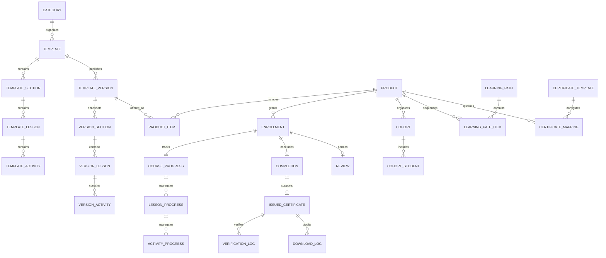
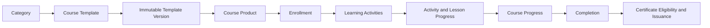

# MIỀN NGHIỆP VỤ KHÓA HỌC

Miền nghiệp vụ Khóa học quản lý vòng đời học tập từ khâu biên soạn và phát hành
bất biến đến Sản phẩm, Ghi danh, Tiến độ học tập và Hoàn thành khóa học. Vì lý
do lịch sử, thư mục này đồng thời chứa dữ liệu lưu trữ của Chứng chỉ; Chứng chỉ
vẫn là một miền nghiệp vụ sở hữu độc lập và được xác định rõ bên dưới.

---

## Tổng quan Miền nghiệp vụ

- **Trách nhiệm nghiệp vụ:** Định nghĩa, phát hành, cung cấp, triển khai và hoàn
  tất các trải nghiệm học tập có Phiên bản.
- **Phạm vi:** Danh mục và biên soạn Khóa học, các Phiên bản bất biến, Sản phẩm,
  chu trình Ghi danh, Lớp học, Tiến độ học tập của học viên, tương tác, Lộ trình
  học tập và Hoàn thành khóa học.
- **Sở hữu:** Template (Mẫu) Khóa học và Phiên bản, liên kết học tập của Sản
  phẩm, Ghi danh, Tiến độ học tập và Hoàn thành khóa học.
- **Không sở hữu:** Kết quả Đánh giá, hoạt động LiveClass, tài sản số Media,
  hành vi Theo dõi, đầu ra AI hoặc điều kiện và việc cấp Chứng chỉ.
- **Miền nghiệp vụ liên quan:** Tenant, Người dùng, Đánh giá, LiveClass, Media,
  Theo dõi, AI và Chứng chỉ.
- **Ranh giới đồng vị trí:** Các bảng `core_certificate_*` trong thư mục này
  thuộc Miền nghiệp vụ Chứng chỉ, không thuộc Miền nghiệp vụ Khóa học.

---

## Các nhóm cơ sở dữ liệu

## 1. Danh mục và biên soạn Khóa học

| Bảng | Mô tả |
|------|------|
| core_course_categories | Danh mục trong Danh mục Khóa học |
| core_course_templates | Blueprint (Thiết kế gốc) Khóa học có thể chỉnh sửa |
| core_course_template_teachers | Giáo viên được phân công cho Blueprint (Thiết kế gốc) Khóa học |
| core_course_template_sections | Phần Khóa học có thể chỉnh sửa |
| core_course_template_lessons | Bài học có thể chỉnh sửa |
| core_course_template_activities | Hoạt động học tập có thể chỉnh sửa |

---

## 2. Phiên bản Khóa học đã phát hành

| Bảng | Mô tả |
|------|------|
| core_course_template_versions | Bản chụp dữ liệu Khóa học đã phát hành và bất biến |
| core_course_template_version_sections | Bản chụp dữ liệu phần đã phát hành |
| core_course_template_version_lessons | Bản chụp dữ liệu bài học đã phát hành |
| core_course_template_version_activities | Bản chụp dữ liệu Hoạt động học tập đã phát hành |

---

## 3. Sản phẩm Khóa học

| Bảng | Mô tả |
|------|------|
| core_course_products | Sản phẩm Khóa học được hiển thị hoặc cấp cho học viên |
| core_course_product_items | Các Phiên bản đã phát hành được đưa vào Sản phẩm |
| core_course_product_relations | Quan hệ giữa các Sản phẩm |

---

## 4. Ghi danh và Lớp học

| Bảng | Mô tả |
|------|------|
| core_course_enrollments | Quyền truy cập và chu trình học của học viên |
| core_course_cohorts | Lớp học và nhóm học vận hành thực tế |
| core_course_cohort_students | Quan hệ thành viên của học viên trong Lớp học |

---

## 5. Tiến độ học tập và Hoàn thành khóa học

| Bảng | Mô tả |
|------|------|
| core_course_progress | Tiến độ học tập cấp Sản phẩm |
| core_course_lesson_progress | Tiến độ học tập cấp Bài học |
| core_course_activity_progress | Tiến độ học tập cấp Hoạt động học tập |
| core_course_completions | Kết quả Hoàn thành khóa học chính thức |

---

## 6. Tương tác của học viên

| Bảng | Mô tả |
|------|------|
| core_course_notes | Ghi chú học tập cá nhân |
| core_course_bookmarks | Vị trí và nội dung học tập đã lưu |
| core_course_favorites | Sản phẩm Khóa học được học viên lưu yêu thích |
| core_course_reviews | Đánh giá Sản phẩm dựa trên Ghi danh |

---

## 7. Lộ trình học tập mang tính học thuật

| Bảng | Mô tả |
|------|------|
| core_course_learning_paths | Lộ trình học thuật có thứ tự |
| core_course_learning_path_items | Các Sản phẩm được sắp xếp trong Lộ trình học tập |

---

## 8. Chính sách và bằng chứng Chứng chỉ — Miền nghiệp vụ Chứng chỉ

| Bảng | Mô tả |
|------|------|
| core_certificate_templates | Thiết kế Chứng chỉ của tenant |
| core_certificate_template_products | Quy tắc và ánh xạ Chứng chỉ theo Sản phẩm |
| core_certificate_issued_certificates | Bằng chứng Chứng chỉ đã cấp và bất biến |
| core_certificate_verification_logs | Lịch sử kiểm tra xác thực Chứng chỉ |
| core_certificate_download_logs | Lịch sử truy cập và tải Chứng chỉ |

---

## Sơ đồ quan hệ Miền nghiệp vụ

---

## Luồng nghiệp vụ

---

## Quan hệ liên Miền nghiệp vụ

Khóa học → Tenant để bảo đảm cô lập  
Khóa học → Người dùng cho giáo viên và học viên  
Khóa học → Media để sử dụng các tài sản học tập có thể tái sử dụng  
Khóa học → Đánh giá để lấy bằng chứng đánh giá  
Khóa học → LiveClass để lấy bằng chứng tham dự và xem lại  
Khóa học → Theo dõi để phát sinh sự kiện hành vi và lấy các bản tổng hợp đã phê duyệt  
Khóa học → AI để cung cấp ngữ cảnh học tập và nhận hỗ trợ ra quyết định  
Khóa học → Chứng chỉ bằng cách cung cấp kết quả Hoàn thành khóa học và ngữ cảnh học tập  
Chứng chỉ → Media để lưu tài sản Chứng chỉ đã kết xuất

---

## Nguyên tắc thiết kế

- Template (Mẫu) Khóa học là nguồn định nghĩa Khóa học có thể chỉnh sửa.
- Việc phát hành tạo ra một Phiên bản Template (Mẫu) bất biến.
- Sản phẩm chứa Phiên bản đã phát hành, không bao giờ chứa Template (Mẫu) đang
  biên soạn.
- Ghi danh là một chu trình học và khóa Phiên bản tương ứng.
- Việc cập nhật Sản phẩm không bao giờ âm thầm chuyển đổi Ghi danh hiện có.
- Tiến độ học tập tham chiếu đến Bài học và Hoạt động học tập đã phát hành.
- Khóa học sở hữu các quyết định về Tiến độ học tập và Hoàn thành khóa học.
- Đánh giá và LiveClass cung cấp bằng chứng thay vì ghi trực tiếp trạng thái
  Khóa học.
- Lộ trình học tập là cấu trúc học thuật, không phải Sản phẩm hoặc gói sản phẩm.
- Chứng chỉ đã cấp vẫn là bằng chứng lịch sử bất biến do Miền nghiệp vụ Chứng
  chỉ sở hữu.
