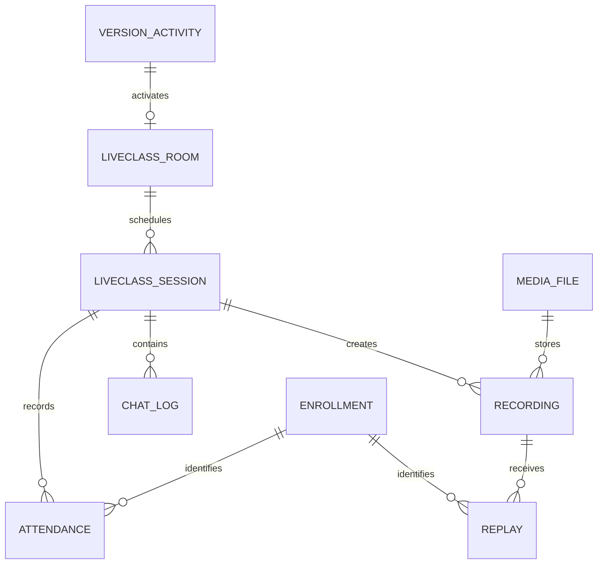
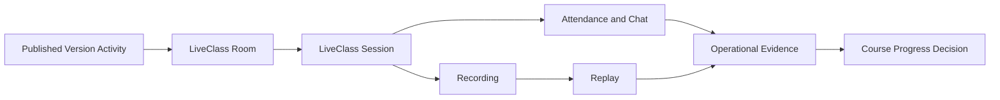

# DOMAIN LIVECLASS

Domain LiveClass quản lý hoạt động học tập đồng bộ và hybrid. Domain này kết
nối các Activity Course đã publish với Room, Session theo lịch, bằng chứng tham
gia, Recording, Replay và Chat mà không sở hữu Course Progress hoặc asset
Media.

---

## Tổng quan Domain

- **Trách nhiệm nghiệp vụ:** Vận hành trải nghiệm học trực tiếp và tạo bằng
  chứng Attendance, Replay.
- **Phạm vi:** Room, Session, Attendance, tham chiếu Recording, tổng hợp Replay
  và Chat trong Session.
- **Sở hữu:** Trạng thái vận hành LiveClass và bằng chứng tham gia.
- **Không sở hữu:** Cấu trúc Course, Progress, Completion, điều kiện cấp
  Certificate, file Recording, sự kiện Track hoặc quyết định AI.
- **Domain liên quan:** Course, Media, Track, AI, User và Tenant.

---

## Các nhóm cơ sở dữ liệu

## 1. Room và lịch học

| Table | Mô tả |
|------|------|
| core_liveclass_rooms | Room vận hành cho các Activity trực tiếp đã publish |
| core_liveclass_sessions | Các buổi học trực tiếp đã lên lịch và hoàn tất |

---

## 2. Tham gia

| Table | Mô tả |
|------|------|
| core_liveclass_attendances | Bằng chứng Attendance của học viên |
| core_liveclass_chat_logs | Lịch sử tương tác trong Session |

---

## 3. Recording và Replay

| Table | Mô tả |
|------|------|
| core_liveclass_recordings | Tham chiếu Recording của Session |
| core_liveclass_replays | Tổng hợp Replay của học viên |

---

## Sơ đồ quan hệ Domain

---

## Luồng nghiệp vụ

---

## Quan hệ liên Domain

LiveClass → Tenant để bảo đảm cô lập  
LiveClass → User cho giáo viên và học viên  
LiveClass → Course để lấy ngữ cảnh Product, Version Activity và Enrollment  
LiveClass → Media cho file Recording, phân phối, Transcript và Caption  
LiveClass → Track để cung cấp sự kiện hành vi  
LiveClass → AI để cung cấp các bản tổng hợp và insight được cấp quyền

---

## Nguyên tắc thiết kế

- LiveClass là một Domain vận hành.
- Hoạt động học tại runtime luôn liên kết với Version Activity đã publish.
- Room và Session là hai khái niệm nghiệp vụ riêng biệt.
- Attendance và Replay là bằng chứng, không phải Course Completion.
- Mỗi Enrollment xác định một chu trình học riêng biệt.
- Binary Recording và quá trình xử lý vẫn do Media sở hữu.
- Chat không trực tiếp quyết định Completion.
- Tác động liên Domain sử dụng bằng chứng, sự kiện hoặc request.
- LiveClass không bao giờ ghi trực tiếp Course Progress.
- Mọi dữ liệu nghiệp vụ LiveClass đều được cô lập theo tenant.
