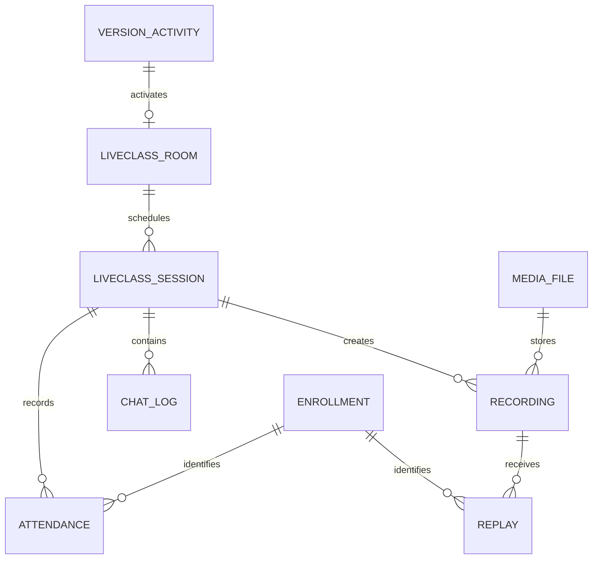
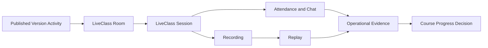

# MIỀN NGHIỆP VỤ LIVECLASS

> ⚠️ **Chưa triển khai**: Đây là spec kiến trúc đã duyệt (ADR-0002, Approved)
> nhưng hiện chưa có migration/model thực tế trong codebase — xem
> `database/migrations/` để biết trạng thái triển khai thật.

Miền nghiệp vụ LiveClass quản lý Activity đồng bộ và kết hợp. Miền
nghiệp vụ này kết nối các Activity của Course đã phát hành với
phòng, phiên học theo lịch, bằng chứng tham gia, bản ghi, hoạt động xem lại và
trò chuyện mà không sở hữu Progress của Course hoặc tài sản Media.

---

## Tổng quan Miền nghiệp vụ

- **Trách nhiệm nghiệp vụ:** Vận hành trải nghiệm học trực tiếp và tạo bằng
  chứng tham dự và xem lại.
- **Phạm vi:** Phòng, phiên học, dữ liệu tham dự, tham chiếu bản ghi, tổng hợp
  hoạt động xem lại và trò chuyện trong phiên học.
- **Sở hữu:** Trạng thái vận hành LiveClass và bằng chứng tham gia.
- **Không sở hữu:** Cấu trúc Course, Progress, Hoàn thành khóa học,
  điều kiện cấp Certificate, tệp bản ghi, Event Track hoặc quyết định AI.
- **Miền nghiệp vụ liên quan:** Course, Media, Track, AI, User và
  Tenant.

---

## Các nhóm cơ sở dữ liệu

## 1. Phòng và lịch học

| Bảng | Mô tả |
|------|------|
| **core_liveclass_rooms** | Phòng vận hành cho các Activity trực tiếp đã phát hành |
| **core_liveclass_sessions** | Các buổi học trực tiếp đã lên lịch và hoàn tất |

---

## 2. Tham gia

| Bảng | Mô tả |
|------|------|
| **core_liveclass_attendances** | Bằng chứng tham dự của học viên |
| **core_liveclass_chat_logs** | Lịch sử tương tác trong phiên học |

---

## 3. Bản ghi và hoạt động xem lại

| Bảng | Mô tả |
|------|------|
| **core_liveclass_recordings** | Tham chiếu bản ghi của phiên học |
| **core_liveclass_replays** | Tổng hợp hoạt động xem lại của học viên |

---

## Sơ đồ quan hệ Miền nghiệp vụ

---

## Luồng nghiệp vụ

---

## Quan hệ liên Miền nghiệp vụ

LiveClass → Tenant để bảo đảm cô lập  
LiveClass → User cho giáo viên và học viên  
LiveClass → Course để lấy ngữ cảnh Product, Version Activity và Enrollment  
LiveClass → Media cho tệp bản ghi, phân phối, bản ghi lời thoại và phụ đề  
LiveClass → Track để cung cấp Event hành vi  
LiveClass → AI để cung cấp các bản tổng hợp và thông tin chuyên sâu được cấp quyền

---

## Nguyên tắc thiết kế

- LiveClass là một miền nghiệp vụ vận hành.
- Hoạt động học tại thời gian chạy luôn liên kết với Version Hoạt động học
  tập đã phát hành.
- Phòng và phiên học là hai khái niệm nghiệp vụ riêng biệt.
- Dữ liệu tham dự và xem lại là bằng chứng, không phải kết quả Hoàn thành khóa
  học.
- Mỗi Enrollment xác định một chu trình học riêng biệt.
- Dữ liệu nhị phân của bản ghi và quá trình xử lý vẫn do Media sở hữu.
- Trò chuyện không trực tiếp quyết định Hoàn thành khóa học.
- Tác động liên miền nghiệp vụ sử dụng bằng chứng, Event hoặc yêu cầu.
- LiveClass không bao giờ ghi trực tiếp Progress của Course.
- Mọi dữ liệu nghiệp vụ LiveClass đều được cô lập theo tenant.
