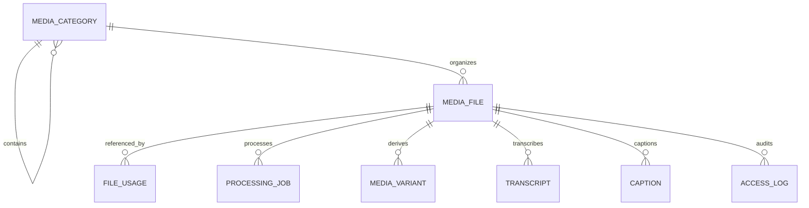
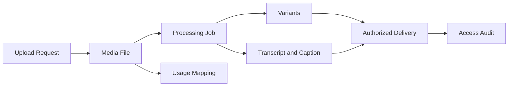

# DOMAIN MEDIA

Domain Media là nền tảng Digital Asset dùng chung của LearnForge. Domain này
quản lý định danh asset, tham chiếu lưu trữ, xử lý, asset dẫn xuất, Transcript,
Caption, mapping sử dụng và lịch sử truy cập, trong khi các Domain tiêu thụ vẫn
giữ thẩm quyền đối với trạng thái nghiệp vụ của mình.

---

## Tổng quan Domain

- **Trách nhiệm nghiệp vụ:** Cung cấp Digital Asset an toàn, nhận biết tenant
  và có thể tái sử dụng trên toàn LearnForge.
- **Phạm vi:** Phân loại asset, metadata lưu trữ, xử lý, Variant, Transcript,
  Caption, mapping sử dụng và lịch sử truy cập.
- **Sở hữu:** Định danh Media, metadata, vị trí lưu trữ, trạng thái xử lý và
  record của asset dẫn xuất.
- **Không sở hữu:** Course Progress, kết quả Assessment, Attendance,
  Certificate, đầu ra AI hoặc quyết định phân quyền của Domain tiêu thụ.
- **Domain liên quan:** Course, LiveClass, Assessment, Certificate, AI, Track,
  User và Tenant.

---

## Các nhóm cơ sở dữ liệu

## 1. Catalog Asset

| Table | Mô tả |
|------|------|
| media_categories | Danh mục nghiệp vụ cho Digital Asset |
| media_files | Record Digital Asset chuẩn |

---

## 2. Sử dụng theo Domain

| Table | Mô tả |
|------|------|
| media_file_usages | Tham chiếu từ asset đến record của Domain tiêu thụ |

---

## 3. Xử lý và asset dẫn xuất

| Table | Mô tả |
|------|------|
| media_processing_jobs | Lifecycle của tác vụ xử lý Media |
| media_variants | Các phiên bản hiển thị của asset dẫn xuất |
| media_transcripts | Nội dung Transcript dẫn xuất |
| media_captions | Asset Caption và phụ đề có thông tin thời gian |

---

## 4. Lịch sử truy cập

| Table | Mô tả |
|------|------|
| media_access_logs | Lịch sử truy cập asset chỉ ghi nối tiếp |

---

## Sơ đồ quan hệ Domain

---

## Luồng nghiệp vụ

---

## Quan hệ liên Domain

Media → Tenant để bảo đảm cô lập và ranh giới lưu trữ  
Media → User cho người upload và truy cập  
Media → Course cho asset học tập và Catalog  
Media → LiveClass cho asset Recording  
Media → Assessment cho asset của Question và Answer  
Media → Certificate cho asset Certificate đã render  
Media → AI để cung cấp tri thức và Transcript được cấp quyền  
Media → Track để cung cấp sự kiện hành vi truy cập đã được phê duyệt

---

## Nguyên tắc thiết kế

- Media là Platform Domain dùng chung.
- Media lưu metadata và tham chiếu lưu trữ, không lưu nội dung binary.
- Nội dung binary đã lưu là bất biến; nội dung thay đổi sẽ tạo asset mới.
- Domain tiêu thụ tham chiếu asset mà không chuyển quyền sở hữu nghiệp vụ.
- Mapping sử dụng generic giúp tránh phụ thuộc chặt vào Domain cụ thể.
- Variant không bao giờ thay thế asset gốc.
- Trạng thái xử lý chỉ thuộc Media.
- Access Log là bằng chứng kiểm tra, không phải trạng thái phân quyền.
- Hoạt động phân phối và lưu trữ luôn được cô lập theo tenant.
- Media không bao giờ quyết định kết quả nghiệp vụ của Domain tiêu thụ.
