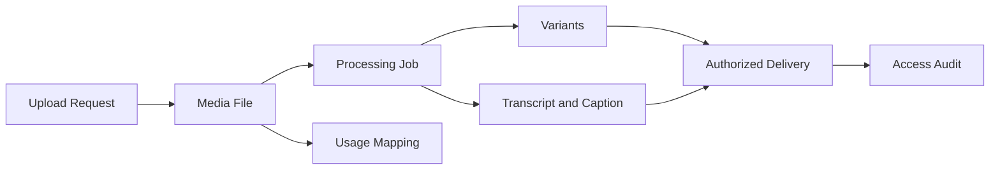

# MIỀN NGHIỆP VỤ MEDIA

Miền nghiệp vụ Media là nền tảng tài sản số dùng chung của LearnForge. Miền
nghiệp vụ này quản lý định danh tài sản, tham chiếu lưu trữ, xử lý, tài sản dẫn
xuất, bản ghi lời thoại, phụ đề, ánh xạ sử dụng và lịch sử truy cập, trong khi
các miền nghiệp vụ tiêu thụ vẫn giữ thẩm quyền đối với trạng thái nghiệp vụ của
mình.

---

## Tổng quan Miền nghiệp vụ

- **Trách nhiệm nghiệp vụ:** Cung cấp tài sản số an toàn, nhận biết tenant
  và có thể tái sử dụng trên toàn LearnForge.
- **Phạm vi:** Phân loại tài sản, metadata lưu trữ, xử lý, biến thể, bản ghi lời
  thoại, phụ đề, ánh xạ sử dụng và lịch sử truy cập.
- **Sở hữu:** Định danh Media, metadata, vị trí lưu trữ, trạng thái xử lý và
  bản ghi của tài sản dẫn xuất.
- **Không sở hữu:** Tiến độ học tập của Khóa học, kết quả Đánh giá, dữ liệu tham
  dự, Chứng chỉ, đầu ra AI hoặc quyết định phân quyền của miền nghiệp vụ tiêu
  thụ.
- **Miền nghiệp vụ liên quan:** Khóa học, LiveClass, Đánh giá, Chứng chỉ, AI,
  Theo dõi, Người dùng và Tenant.

---

## Các nhóm cơ sở dữ liệu

## 1. Danh mục tài sản

| Bảng | Mô tả |
|------|------|
| media_categories | Danh mục nghiệp vụ cho tài sản số |
| media_files | Bản ghi tài sản số chuẩn |

---

## 2. Sử dụng theo Miền nghiệp vụ

| Bảng | Mô tả |
|------|------|
| media_file_usages | Tham chiếu từ tài sản đến bản ghi của miền nghiệp vụ tiêu thụ |

---

## 3. Xử lý và tài sản dẫn xuất

| Bảng | Mô tả |
|------|------|
| media_processing_jobs | Vòng đời của tác vụ xử lý Media |
| media_variants | Các biến thể hiển thị của tài sản dẫn xuất |
| media_transcripts | Nội dung bản ghi lời thoại dẫn xuất |
| media_captions | Tài sản phụ đề có thông tin thời gian |

---

## 4. Lịch sử truy cập

| Bảng | Mô tả |
|------|------|
| media_access_logs | Lịch sử truy cập tài sản chỉ ghi nối tiếp |

---

## Sơ đồ quan hệ Miền nghiệp vụ

```mermaid
erDiagram
    MEDIA_CATEGORY ||--o{ MEDIA_CATEGORY : contains
    MEDIA_CATEGORY ||--o{ MEDIA_FILE : organizes
    MEDIA_FILE ||--o{ FILE_USAGE : referenced_by
    MEDIA_FILE ||--o{ PROCESSING_JOB : processes
    MEDIA_FILE ||--o{ MEDIA_VARIANT : derives
    MEDIA_FILE ||--o{ TRANSCRIPT : transcribes
    MEDIA_FILE ||--o{ CAPTION : captions
    MEDIA_FILE ||--o{ ACCESS_LOG : audits
```

---

## Luồng nghiệp vụ

---

## Quan hệ liên Miền nghiệp vụ

Media → Tenant để bảo đảm cô lập và ranh giới lưu trữ  
Media → Người dùng cho người tải lên và truy cập  
Media → Khóa học cho tài sản học tập và danh mục  
Media → LiveClass cho tài sản bản ghi  
Media → Đánh giá cho tài sản của câu hỏi và câu trả lời  
Media → Chứng chỉ cho tài sản Chứng chỉ đã kết xuất  
Media → AI để cung cấp tri thức và bản ghi lời thoại được cấp quyền  
Media → Theo dõi để cung cấp sự kiện hành vi truy cập đã được phê duyệt

---

## Nguyên tắc thiết kế

- Media là miền nghiệp vụ nền tảng dùng chung.
- Media lưu metadata và tham chiếu lưu trữ, không lưu nội dung nhị phân.
- Nội dung nhị phân đã lưu là bất biến; nội dung thay đổi sẽ tạo tài sản mới.
- Miền nghiệp vụ tiêu thụ tham chiếu tài sản mà không chuyển quyền sở hữu dữ
  liệu nghiệp vụ.
- Ánh xạ sử dụng tổng quát giúp tránh phụ thuộc chặt vào miền nghiệp vụ cụ thể.
- Biến thể không bao giờ thay thế tài sản gốc.
- Trạng thái xử lý chỉ thuộc Media.
- Nhật ký truy cập là bằng chứng kiểm tra, không phải trạng thái phân quyền.
- Hoạt động phân phối và lưu trữ luôn được cô lập theo tenant.
- Media không bao giờ quyết định kết quả nghiệp vụ của miền nghiệp vụ tiêu thụ.
