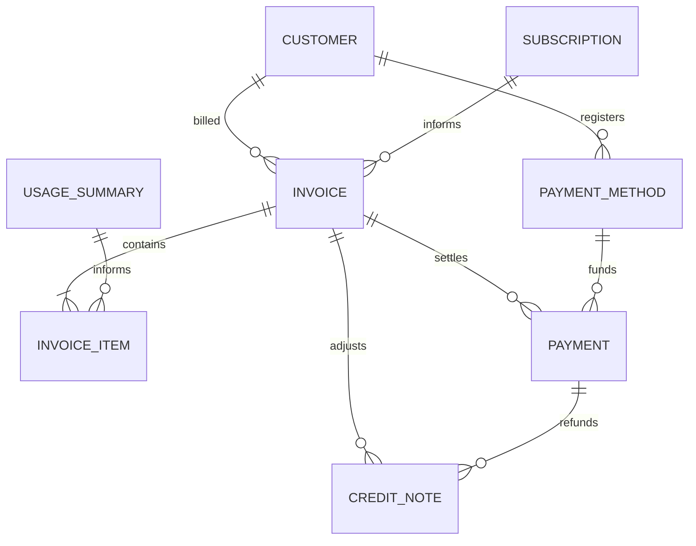
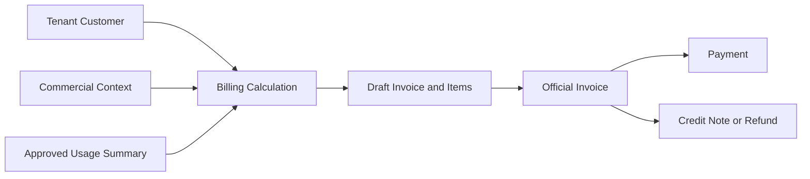

# MIỀN NGHIỆP VỤ SAAS THANH TOÁN

Miền nghiệp vụ SaaS Thanh toán ghi nhận khoản Khách hàng phải thanh toán và
cách nghĩa vụ đó được quyết toán hoặc điều chỉnh. Miền nghiệp vụ này chuyển
đầu vào Thương mại và Mức sử dụng đã được phê duyệt thành Hóa đơn, Thanh toán,
tham chiếu phương thức thanh toán và phiếu ghi có mà không thay đổi trạng thái
nguồn của các miền nghiệp vụ phía trước.

---

## Tổng quan Miền nghiệp vụ

- **Trách nhiệm nghiệp vụ:** Sở hữu nghĩa vụ tài chính và quyết toán được biểu
  thị bằng “Thanh toán.”.
- **Phạm vi:** Hóa đơn, hạng mục Hóa đơn, Thanh toán, phương thức thanh toán,
  phiếu ghi có và hoàn tiền.
- **Sở hữu:** Vòng đời Hóa đơn, Bản chụp dữ liệu khoản phí chính thức, đối soát
  Thanh toán và điều chỉnh tài chính.
- **Không sở hữu:** Khách hàng, Gói dịch vụ, Đăng ký dịch vụ, Quyền sử dụng,
  phép đo Mức sử dụng, trạng thái học tập, trạng thái Media, hành vi Theo dõi
  hoặc đầu ra AI.
- **Miền nghiệp vụ liên quan:** Tenant, Thương mại, Mức sử dụng và các nhà cung
  cấp thanh toán đã được phê duyệt.

---

## Các nhóm cơ sở dữ liệu

## 1. Lập hóa đơn

| Bảng | Mô tả |
|------|------|
| saas_invoices | Nghĩa vụ thanh toán chính thức của Khách hàng |
| saas_invoice_items | Bản chụp dữ liệu dòng Hóa đơn bất biến |

---

## 2. Quyết toán Thanh toán

| Bảng | Mô tả |
|------|------|
| saas_payment_methods | Tham chiếu an toàn đến nhà cung cấp thanh toán |
| saas_payments | Giao dịch và hoạt động đối soát Thanh toán |

---

## 3. Điều chỉnh và hoàn tiền

| Bảng | Mô tả |
|------|------|
| saas_credit_notes | Chứng từ điều chỉnh Hóa đơn và hoàn tiền |

---

## Sơ đồ quan hệ Miền nghiệp vụ

---

## Luồng nghiệp vụ

---

## Quan hệ liên Miền nghiệp vụ

Thanh toán → Tenant để lấy định danh Khách hàng và bảo đảm cô lập  
Thanh toán → Thương mại để lấy ngữ cảnh Đăng ký dịch vụ và Quyền sử dụng  
Thanh toán → Mức sử dụng để lấy bản tổng hợp mức tiêu thụ đã được phê duyệt  
Thanh toán → Nhà cung cấp thanh toán để đối soát giao dịch  
Thanh toán → Thương mại thông qua sự kiện hoặc yêu cầu khi quyết toán có thể ảnh hưởng quyền truy cập

---

## Nguyên tắc thiết kế

- Miền nghiệp vụ Thanh toán chỉ trả lời “Thanh toán.”.
- Hóa đơn đã phát hành và Bản chụp dữ liệu các dòng tương ứng là bất biến.
- Thanh toán bảo toàn lịch sử giao dịch và đối soát.
- Phương thức thanh toán lưu tham chiếu an toàn đến nhà cung cấp, không bao giờ lưu
  thông tin xác thực thô.
- Phiếu ghi có điều chỉnh Hóa đơn mà không ghi lại Hóa đơn.
- Mọi khoản hoàn tiền đều được biểu diễn bằng phiếu ghi có.
- Hạng mục Hóa đơn không trở thành Nguồn dữ liệu chuẩn của Mức sử dụng.
- Thanh toán không trực tiếp thay đổi Quyền sử dụng.
- Miền nghiệp vụ Thanh toán đọc nhưng không bao giờ ghi đè trạng thái Tenant,
  Thương mại hoặc Mức sử dụng.
- Mọi bản ghi tài chính đều được cô lập theo tenant.
