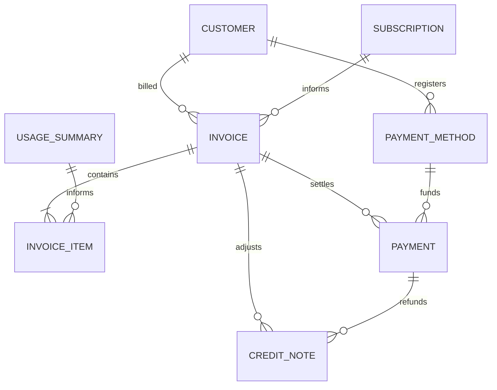
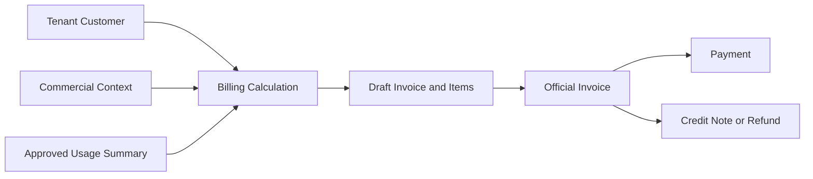

# MIỀN NGHIỆP VỤ SAAS BILLING

Miền nghiệp vụ SaaS Billing ghi nhận khoản Customer phải thanh toán và
cách nghĩa vụ đó được quyết toán hoặc điều chỉnh. Miền nghiệp vụ này chuyển
đầu vào Commercial và Usage đã được phê duyệt thành Hóa đơn, Thanh toán,
tham chiếu phương thức thanh toán và phiếu ghi có mà không thay đổi trạng thái
nguồn của các miền nghiệp vụ phía trước.

---

## Tổng quan Miền nghiệp vụ

- **Trách nhiệm nghiệp vụ:** Sở hữu nghĩa vụ tài chính và quyết toán được biểu
  thị bằng “Thanh toán.”.
- **Phạm vi:** Hóa đơn, hạng mục Hóa đơn, Thanh toán, phương thức thanh toán,
  phiếu ghi có và hoàn tiền.
- **Sở hữu:** Vòng đời Hóa đơn, Snapshot khoản phí chính thức, đối soát
  Thanh toán và điều chỉnh tài chính.
- **Không sở hữu:** Customer, Gói dịch vụ, Subscription, Entitlement,
  phép đo Usage, trạng thái học tập, trạng thái Media, hành vi Track
  hoặc đầu ra AI.
- **Miền nghiệp vụ liên quan:** Tenant, Commercial, Usage và các nhà cung
  cấp thanh toán đã được phê duyệt.

---

## Các nhóm cơ sở dữ liệu

## 1. Lập hóa đơn

| Bảng | Mô tả |
|------|------|
| **saas_invoices** | Nghĩa vụ thanh toán chính thức của Customer |
| **saas_invoice_items** | Snapshot dòng Hóa đơn bất biến |

---

## 2. Quyết toán thanh toán

| Bảng | Mô tả |
|------|------|
| **saas_payment_methods** | Tham chiếu an toàn đến Provider thanh toán |
| **saas_payments** | Giao dịch và hoạt động đối soát Thanh toán |

---

## 3. Điều chỉnh và hoàn tiền

| Bảng | Mô tả |
|------|------|
| **saas_credit_notes** | Chứng từ điều chỉnh Hóa đơn và hoàn tiền |

---

## Sơ đồ quan hệ Miền nghiệp vụ

---

## Luồng nghiệp vụ

---

## Quan hệ liên Miền nghiệp vụ

Billing → Tenant để lấy định danh Customer và bảo đảm cô lập  
Billing → Commercial để lấy ngữ cảnh Subscription và Entitlement  
Billing → Usage để lấy bản tổng hợp mức tiêu thụ đã được phê duyệt  
Billing → Provider thanh toán để đối soát giao dịch  
Billing → Commercial thông qua Event hoặc yêu cầu khi quyết toán có thể ảnh hưởng quyền truy cập

---

## Nguyên tắc thiết kế

- Miền nghiệp vụ Billing chỉ trả lời “Thanh toán.”.
- Hóa đơn đã phát hành và Snapshot các dòng tương ứng là bất biến.
- Thanh toán bảo toàn lịch sử giao dịch và đối soát.
- Phương thức thanh toán lưu tham chiếu an toàn đến Provider, không bao giờ lưu
  thông tin xác thực thô.
- Phiếu ghi có điều chỉnh Hóa đơn mà không ghi lại Hóa đơn.
- Mọi khoản hoàn tiền đều được biểu diễn bằng phiếu ghi có.
- Hạng mục Hóa đơn không trở thành Nguồn dữ liệu chuẩn của Usage.
- Thanh toán không trực tiếp thay đổi Entitlement.
- Miền nghiệp vụ Billing đọc nhưng không bao giờ ghi đè trạng thái Tenant,
  Commercial hoặc Usage.
- Mọi bản ghi tài chính đều được cô lập theo tenant.
