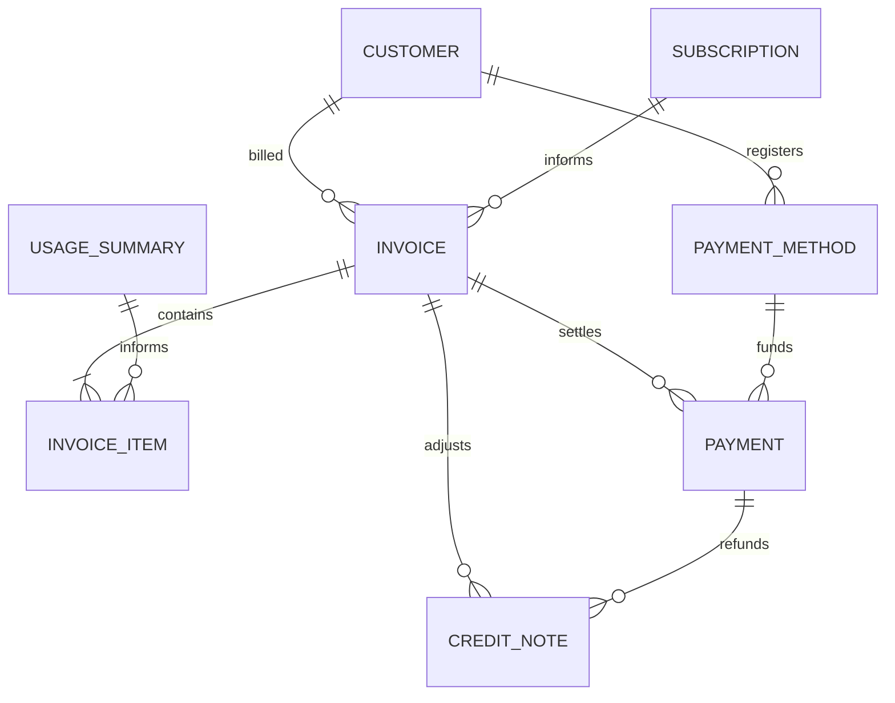
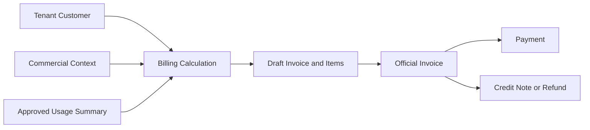

# DOMAIN SAAS BILLING

Domain SaaS Billing ghi nhận khoản Customer phải thanh toán và cách nghĩa vụ đó
được quyết toán hoặc điều chỉnh. Domain này chuyển đầu vào Commercial và Usage
đã được phê duyệt thành Invoice, Payment, tham chiếu Payment Method và Credit
Note mà không thay đổi trạng thái nguồn của các Domain phía trước.

---

## Tổng quan Domain

- **Trách nhiệm nghiệp vụ:** Sở hữu nghĩa vụ tài chính và quyết toán được biểu
  thị bằng “Thanh toán.”.
- **Phạm vi:** Invoice, Invoice Item, Payment, Payment Method, Credit Note và
  Refund.
- **Sở hữu:** Lifecycle Invoice, snapshot khoản phí chính thức, đối soát
  Payment và điều chỉnh tài chính.
- **Không sở hữu:** Customer, Plan, Subscription, Entitlement, phép đo Usage,
  trạng thái học tập, trạng thái Media, hành vi Track hoặc đầu ra AI.
- **Domain liên quan:** Tenant, Commercial, Usage và các nhà cung cấp Payment
  đã được phê duyệt.

---

## Các nhóm cơ sở dữ liệu

## 1. Lập hóa đơn

| Table | Mô tả |
|------|------|
| saas_invoices | Nghĩa vụ thanh toán chính thức của Customer |
| saas_invoice_items | Snapshot dòng Invoice bất biến |

---

## 2. Quyết toán Payment

| Table | Mô tả |
|------|------|
| saas_payment_methods | Tham chiếu an toàn đến nhà cung cấp Payment |
| saas_payments | Giao dịch và hoạt động đối soát Payment |

---

## 3. Điều chỉnh và Refund

| Table | Mô tả |
|------|------|
| saas_credit_notes | Chứng từ điều chỉnh Invoice và Refund |

---

## Sơ đồ quan hệ Domain

---

## Luồng nghiệp vụ

---

## Quan hệ liên Domain

Billing → Tenant để lấy định danh Customer và bảo đảm cô lập  
Billing → Commercial để lấy ngữ cảnh Subscription và Entitlement  
Billing → Usage để lấy Summary mức tiêu thụ đã được phê duyệt  
Billing → Nhà cung cấp Payment để đối soát giao dịch  
Billing → Commercial thông qua sự kiện hoặc request khi quyết toán có thể ảnh hưởng quyền truy cập

---

## Nguyên tắc thiết kế

- Billing chỉ trả lời “Thanh toán.”.
- Invoice đã phát hành và snapshot các dòng tương ứng là bất biến.
- Payment bảo toàn lịch sử giao dịch và đối soát.
- Payment Method lưu tham chiếu an toàn đến nhà cung cấp, không bao giờ lưu
  thông tin xác thực thô.
- Credit Note điều chỉnh Invoice mà không ghi lại Invoice.
- Mọi Refund đều được biểu diễn bằng Credit Note.
- Invoice Item không trở thành Source Of Truth của Usage.
- Payment không trực tiếp thay đổi Entitlement.
- Billing đọc nhưng không bao giờ ghi đè trạng thái Tenant, Commercial hoặc
  Usage.
- Mọi record tài chính đều được cô lập theo tenant.
