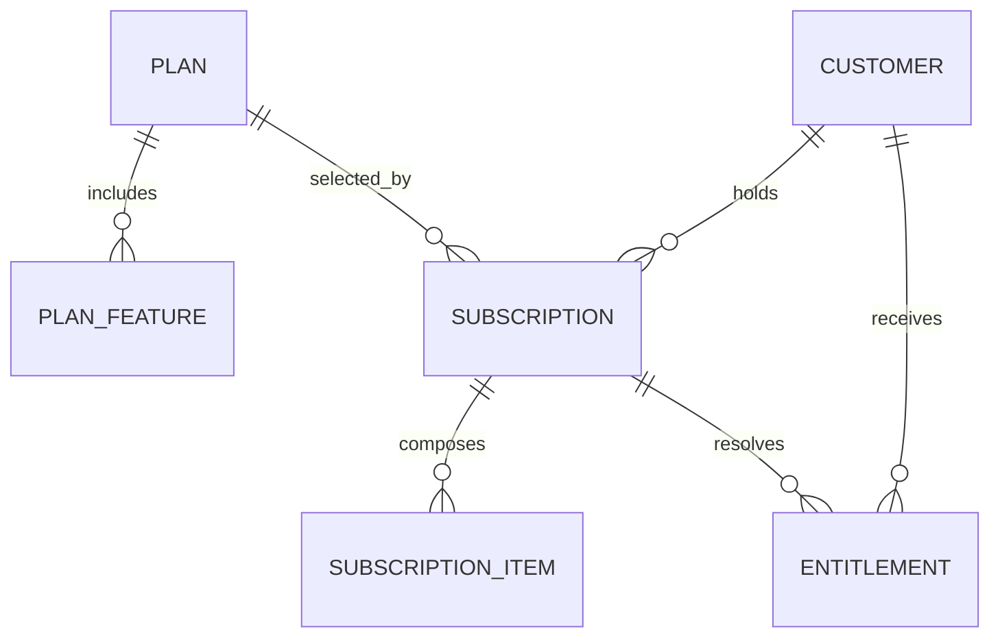
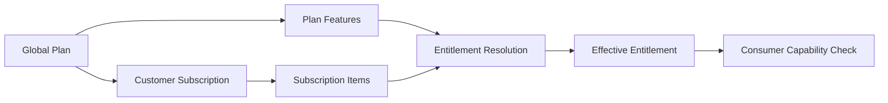

# DOMAIN SAAS COMMERCIAL

Domain SaaS Commercial xác định những capability LearnForge mà Customer được
phép sử dụng. Domain này quản lý Catalog Plan toàn cục, lifecycle Subscription
của Customer, cấu phần Subscription và Entitlement hiệu lực, đồng thời tách
phép đo Usage và nghĩa vụ Billing sang các Domain riêng.

---

## Tổng quan Domain

- **Trách nhiệm nghiệp vụ:** Xác định quyền thương mại hiệu lực được biểu thị
  bằng câu hỏi “Có thể sử dụng?”.
- **Phạm vi:** Plan, Plan Feature, Subscription, Subscription Item và
  Entitlement.
- **Sở hữu:** Catalog Plan, lifecycle Subscription và quyền capability hiệu lực
  của Customer.
- **Không sở hữu:** Định danh Customer, Usage hiện tại, tính giá, Invoice,
  Payment hoặc trạng thái nghiệp vụ về học tập và AI.
- **Domain liên quan:** Tenant, Usage, Billing, AI, Media, Course, Assessment
  và LiveClass.

---

## Các nhóm cơ sở dữ liệu

## 1. Catalog Plan

| Table | Mô tả |
|------|------|
| saas_plans | Catalog Plan thương mại toàn cục |
| saas_plan_features | Quyền sử dụng Feature mặc định theo Plan |

---

## 2. Subscription của Customer

| Table | Mô tả |
|------|------|
| saas_subscriptions | Lifecycle Subscription của Customer |
| saas_subscription_items | Add-on và Package trong Subscription |

---

## 3. Quyền hiệu lực

| Table | Mô tả |
|------|------|
| saas_entitlements | Quyền Feature hiệu lực của Customer |

---

## Sơ đồ quan hệ Domain

---

## Luồng nghiệp vụ

---

## Quan hệ liên Domain

Commercial → Tenant để lấy định danh và ngữ cảnh Customer  
Commercial → Usage để cung cấp giới hạn được phép cho việc so sánh đã dùng và được phép  
Commercial → Billing để cung cấp ngữ cảnh Subscription và Entitlement  
Commercial → AI, Course, Assessment, LiveClass và Media để kiểm tra capability

---

## Nguyên tắc thiết kế

- Commercial chỉ trả lời câu hỏi “Có thể sử dụng?”.
- Plan tạo thành Catalog toàn cục thay vì dữ liệu nghiệp vụ tenant.
- Plan Feature là giá trị mặc định, không phải quyền hiệu lực của Customer.
- Subscription bảo toàn lifecycle Plan của Customer.
- Subscription Item cấu thành các Add-on và Package.
- Entitlement là Source Of Truth cuối cùng cho quyền capability hiệu lực.
- Entitlement không bao giờ lưu mức tiêu thụ hiện tại.
- Domain tiêu thụ chỉ đọc, không ghi trạng thái Commercial.
- Usage và Billing duy trì các Source Of Truth độc lập.
- Record Commercial có phạm vi tenant luôn được cô lập theo Customer.
