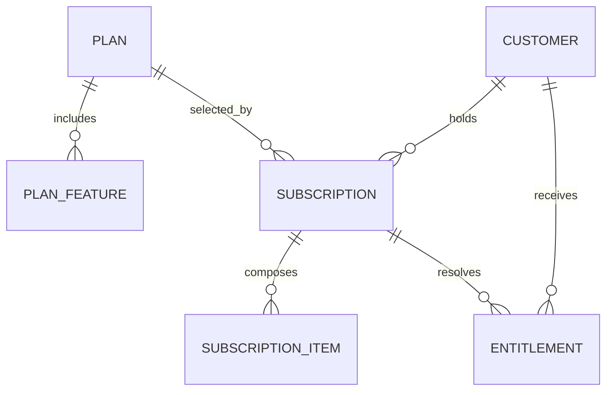
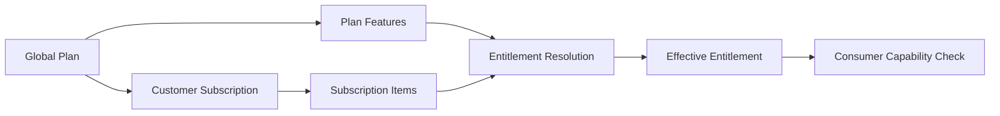

# MIỀN NGHIỆP VỤ SAAS COMMERCIAL

Document Path: database/saas-commercial/README.md

> ⚠️ **Chưa triển khai**: Đây là spec kiến trúc đã duyệt (ADR-0008, Frozen)
> nhưng hiện chưa có migration/model thực tế trong codebase — xem
> `database/migrations/` để biết trạng thái triển khai thật.

Miền nghiệp vụ SaaS Commercial xác định những tính năng LearnForge mà Customer
được phép sử dụng. Miền nghiệp vụ này quản lý danh mục Gói dịch vụ toàn
cục, vòng đời Subscription của Customer, cấu phần Subscription và
Entitlement hiệu lực, đồng thời tách phép đo Usage và nghĩa vụ Billing sang các
miền nghiệp vụ riêng.

---

## Tổng quan Miền nghiệp vụ

- **Trách nhiệm nghiệp vụ:** Xác định quyền thương mại hiệu lực được biểu thị
  bằng câu hỏi “Có thể sử dụng?”.
- **Phạm vi:** Gói dịch vụ, tính năng theo Gói dịch vụ, Subscription, hạng
  mục Subscription và Entitlement.
- **Sở hữu:** Danh mục Gói dịch vụ, vòng đời Subscription và quyền sử dụng
  tính năng hiệu lực của Customer.
- **Không sở hữu:** Định danh Customer, Usage hiện tại, tính giá, hóa đơn,
  thanh toán hoặc trạng thái nghiệp vụ về học tập và AI.
- **Miền nghiệp vụ liên quan:** Tenant, Usage, Billing, AI, Media, Course,
  Assessment và LiveClass.

---

## Các nhóm cơ sở dữ liệu

## 1. Danh mục Gói dịch vụ

| Bảng | Mô tả |
|------|------|
| **saas_plans** | Danh mục Gói dịch vụ thương mại toàn cục |
| **saas_plan_features** | Entitlement tính năng mặc định theo Gói dịch vụ |

---

## 2. Subscription của Customer

| Bảng | Mô tả |
|------|------|
| **saas_subscriptions** | Vòng đời Subscription của Customer |
| **saas_subscription_items** | Tiện ích bổ sung và gói thành phần trong Subscription |

---

## 3. Quyền hiệu lực

| Bảng | Mô tả |
|------|------|
| **saas_entitlements** | Entitlement tính năng hiệu lực của Customer |

---

## Sơ đồ quan hệ Miền nghiệp vụ

---

## Luồng nghiệp vụ

---

## Quan hệ liên Miền nghiệp vụ

Commercial → Tenant để lấy định danh và ngữ cảnh Customer  
Commercial → Usage để cung cấp giới hạn được phép cho việc so sánh đã dùng và được phép  
Commercial → Billing để cung cấp ngữ cảnh Subscription và Entitlement  
Commercial → AI, Course, Assessment, LiveClass và Media để kiểm tra tính năng

---

## Nguyên tắc thiết kế

- Commercial chỉ trả lời câu hỏi “Có thể sử dụng?”.
- Gói dịch vụ tạo thành danh mục toàn cục thay vì dữ liệu nghiệp vụ tenant.
- Tính năng theo Gói dịch vụ là giá trị mặc định, không phải quyền hiệu lực của
  Customer.
- Subscription bảo toàn vòng đời Gói dịch vụ của Customer.
- Hạng mục Subscription cấu thành các tiện ích bổ sung và gói thành phần.
- Entitlement là Nguồn dữ liệu chuẩn cuối cùng cho quyền sử dụng tính năng
  hiệu lực.
- Entitlement không bao giờ lưu mức tiêu thụ hiện tại.
- Miền nghiệp vụ tiêu thụ chỉ đọc, không ghi trạng thái Commercial.
- Usage và Billing duy trì các Nguồn dữ liệu chuẩn độc lập.
- Bản ghi Commercial có phạm vi tenant luôn được cô lập theo Customer.
