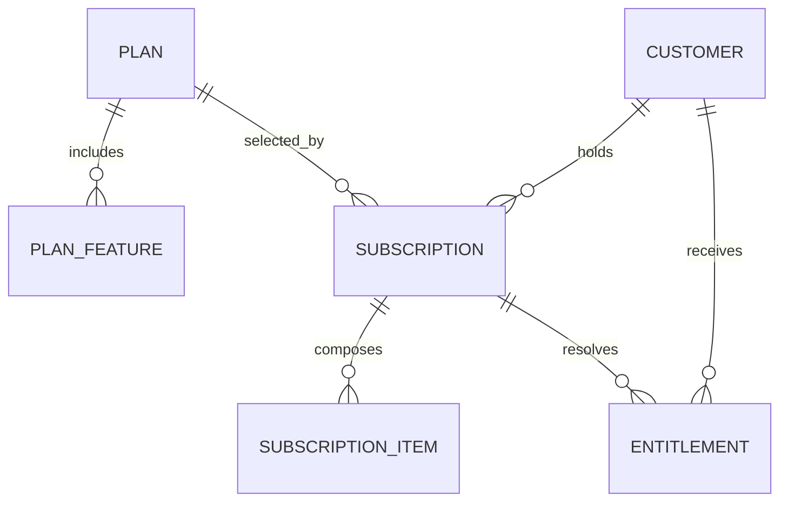
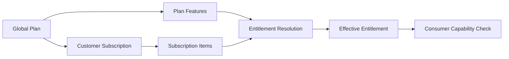

# MIỀN NGHIỆP VỤ SAAS THƯƠNG MẠI

Miền nghiệp vụ SaaS Thương mại xác định những tính năng LearnForge mà Khách
hàng được phép sử dụng. Miền nghiệp vụ này quản lý danh mục Gói dịch vụ toàn
cục, vòng đời Đăng ký dịch vụ của Khách hàng, cấu phần Đăng ký dịch vụ và
Quyền sử dụng hiệu lực, đồng thời tách phép đo Mức sử dụng và nghĩa vụ Thanh
toán sang các miền nghiệp vụ riêng.

---

## Tổng quan Miền nghiệp vụ

- **Trách nhiệm nghiệp vụ:** Xác định quyền thương mại hiệu lực được biểu thị
  bằng câu hỏi “Có thể sử dụng?”.
- **Phạm vi:** Gói dịch vụ, tính năng theo Gói dịch vụ, Đăng ký dịch vụ, hạng
  mục Đăng ký dịch vụ và Quyền sử dụng.
- **Sở hữu:** Danh mục Gói dịch vụ, vòng đời Đăng ký dịch vụ và quyền sử dụng
  tính năng hiệu lực của Khách hàng.
- **Không sở hữu:** Định danh Khách hàng, Mức sử dụng hiện tại, tính giá, Hóa
  đơn, Thanh toán hoặc trạng thái nghiệp vụ về học tập và AI.
- **Miền nghiệp vụ liên quan:** Tenant, Mức sử dụng, Thanh toán, AI, Media, Khóa
  học, Đánh giá và LiveClass.

---

## Các nhóm cơ sở dữ liệu

## 1. Danh mục Gói dịch vụ

| Bảng | Mô tả |
|------|------|
| saas_plans | Danh mục Gói dịch vụ thương mại toàn cục |
| saas_plan_features | Quyền sử dụng tính năng mặc định theo Gói dịch vụ |

---

## 2. Đăng ký dịch vụ của Khách hàng

| Bảng | Mô tả |
|------|------|
| saas_subscriptions | Vòng đời Đăng ký dịch vụ của Khách hàng |
| saas_subscription_items | Tiện ích bổ sung và gói thành phần trong Đăng ký dịch vụ |

---

## 3. Quyền hiệu lực

| Bảng | Mô tả |
|------|------|
| saas_entitlements | Quyền sử dụng tính năng hiệu lực của Khách hàng |

---

## Sơ đồ quan hệ Miền nghiệp vụ

---

## Luồng nghiệp vụ

---

## Quan hệ liên Miền nghiệp vụ

Thương mại → Tenant để lấy định danh và ngữ cảnh Khách hàng  
Thương mại → Mức sử dụng để cung cấp giới hạn được phép cho việc so sánh đã dùng và được phép  
Thương mại → Thanh toán để cung cấp ngữ cảnh Đăng ký dịch vụ và Quyền sử dụng  
Thương mại → AI, Khóa học, Đánh giá, LiveClass và Media để kiểm tra tính năng

---

## Nguyên tắc thiết kế

- Thương mại chỉ trả lời câu hỏi “Có thể sử dụng?”.
- Gói dịch vụ tạo thành danh mục toàn cục thay vì dữ liệu nghiệp vụ tenant.
- Tính năng theo Gói dịch vụ là giá trị mặc định, không phải quyền hiệu lực của
  Khách hàng.
- Đăng ký dịch vụ bảo toàn vòng đời Gói dịch vụ của Khách hàng.
- Hạng mục Đăng ký dịch vụ cấu thành các tiện ích bổ sung và gói thành phần.
- Quyền sử dụng là Nguồn dữ liệu chuẩn cuối cùng cho quyền sử dụng tính năng
  hiệu lực.
- Quyền sử dụng không bao giờ lưu mức tiêu thụ hiện tại.
- Miền nghiệp vụ tiêu thụ chỉ đọc, không ghi trạng thái Thương mại.
- Mức sử dụng và Thanh toán duy trì các Nguồn dữ liệu chuẩn độc lập.
- Bản ghi Thương mại có phạm vi tenant luôn được cô lập theo Khách hàng.
