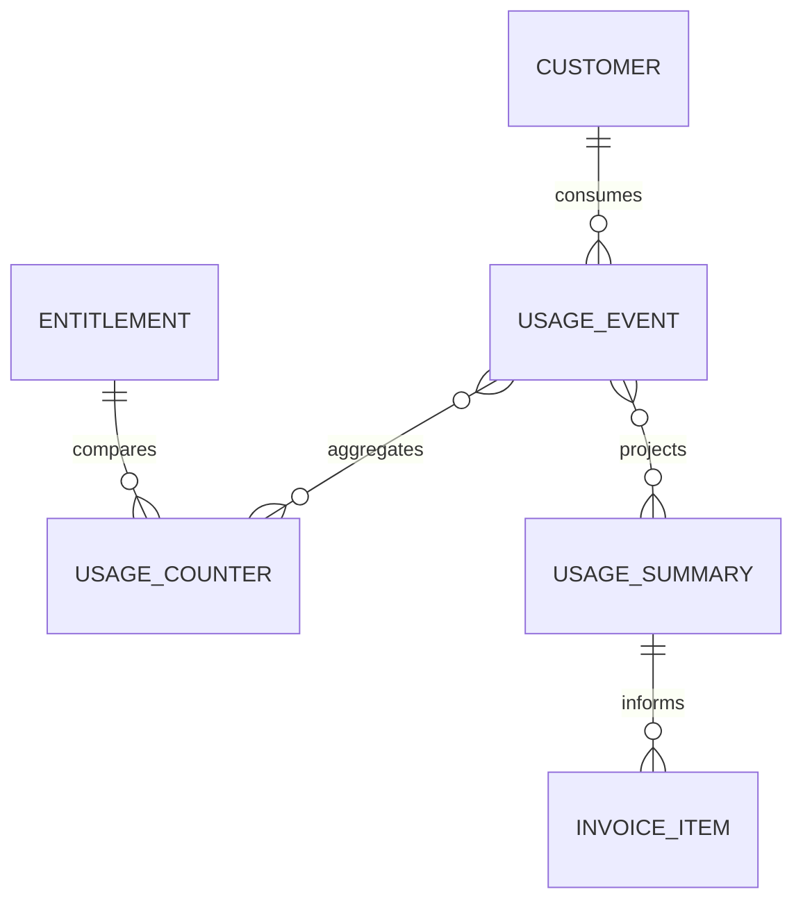
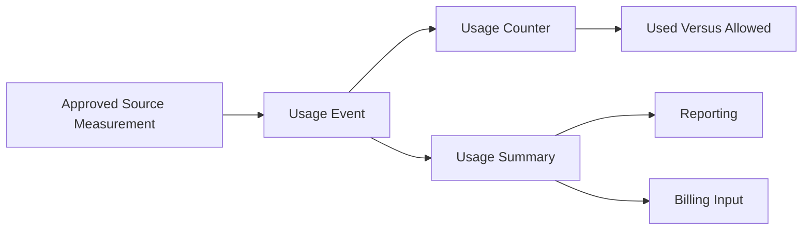

# DOMAIN SAAS USAGE

Domain SaaS Usage đo lường lượng tài nguyên LearnForge mà mỗi Customer đã tiêu
thụ. Domain này lưu giữ các phép đo chỉ ghi nối tiếp và xây dựng Counter hiện
tại cùng Summary có version phục vụ báo cáo, so sánh quota và Billing mà không
sở hữu Entitlement hoặc khoản phí.

---

## Tổng quan Domain

- **Trách nhiệm nghiệp vụ:** Ghi nhận và tổng hợp mức tiêu thụ tài nguyên được
  biểu thị bằng “Đã sử dụng.”.
- **Phạm vi:** Usage Event, Counter tích lũy và Summary phục vụ báo cáo hoặc
  Billing.
- **Sở hữu:** Phép đo Usage thô và Projection dẫn xuất từ Usage.
- **Không sở hữu:** Customer, Subscription, Entitlement, giới hạn được phép,
  tính giá, Invoice, Payment, Track Event, AI Model Run hoặc trạng thái của
  Domain nguồn.
- **Domain liên quan:** Tenant, Commercial, Billing, AI, Media, LiveClass,
  Track và các nguồn phép đo đã được phê duyệt khác.

---

## Các nhóm cơ sở dữ liệu

## 1. Đo lường Usage

| Table | Mô tả |
|------|------|
| saas_usage_events | Phép đo mức tiêu thụ tài nguyên chỉ ghi nối tiếp |

---

## 2. Projection Usage

| Table | Mô tả |
|------|------|
| saas_usage_counters | Projection mức sử dụng tích lũy hiện tại |
| saas_usage_summaries | Summary có version cho báo cáo và Billing |

---

## Sơ đồ quan hệ Domain

---

## Luồng nghiệp vụ

---

## Quan hệ liên Domain

Usage → Tenant để lấy định danh Customer và bảo đảm cô lập  
Usage → Commercial để lấy ngữ cảnh Subscription và Entitlement  
Usage → Billing để cung cấp Summary Usage đã được phê duyệt  
Usage → AI để nhận phép đo thực thi đã được phê duyệt  
Usage → Media và LiveClass để nhận phép đo tài nguyên đã được phê duyệt  
Usage → Track chỉ thông qua mapping phép đo rõ ràng

---

## Nguyên tắc thiết kế

- Usage chỉ trả lời “Đã sử dụng.”.
- Usage Event là Source Of Truth của phép đo.
- Usage Event chỉ được ghi nối tiếp.
- Counter và Summary là các Projection có thể tái tạo.
- Projection không bao giờ ghi ngược vào lịch sử phép đo.
- Contract Metric phải rõ ràng và ổn định.
- Quota được phép vẫn thuộc quyền sở hữu của Commercial Entitlement.
- Tính giá, Invoice và Payment vẫn thuộc quyền sở hữu của Billing.
- Usage Event không thay thế Track Event hoặc record của Domain nguồn.
- Mọi phép đo Usage đều được cô lập theo tenant.
