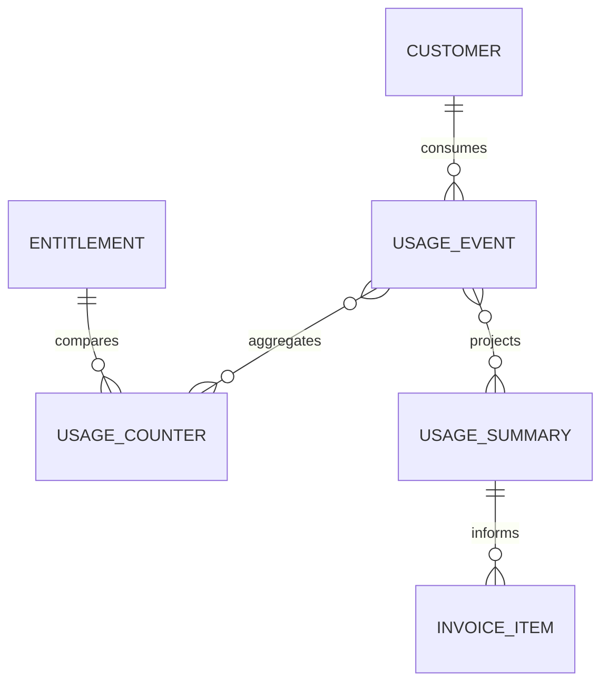
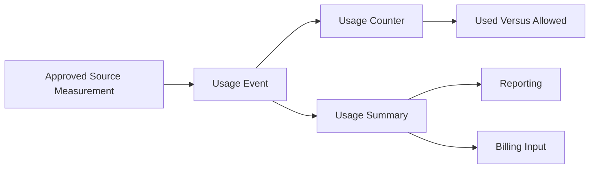

# MIỀN NGHIỆP VỤ SAAS USAGE

> ⚠️ **Chưa triển khai**: Đây là spec kiến trúc đã duyệt (ADR-0009, Frozen)
> nhưng hiện chưa có migration/model thực tế trong codebase — xem
> `database/migrations/` để biết trạng thái triển khai thật.

Miền nghiệp vụ SaaS Usage đo lường lượng tài nguyên LearnForge mà mỗi
Customer đã tiêu thụ. Miền nghiệp vụ này lưu giữ các phép đo chỉ ghi nối tiếp
và xây dựng bộ đếm hiện tại cùng bản tổng hợp có Version phục vụ báo cáo, so
sánh hạn mức và Billing mà không sở hữu Entitlement hoặc khoản phí.

---

## Tổng quan Miền nghiệp vụ

- **Trách nhiệm nghiệp vụ:** Ghi nhận và tổng hợp mức tiêu thụ tài nguyên được
  biểu thị bằng “Đã sử dụng.”.
- **Phạm vi:** Event Usage, bộ đếm tích lũy và bản tổng hợp phục vụ báo
  cáo hoặc Billing.
- **Sở hữu:** Phép đo Usage thô và mô hình chiếu dẫn xuất từ Usage.
- **Không sở hữu:** Customer, Subscription, Entitlement, giới hạn được
  phép, tính giá, hóa đơn, thanh toán, Event Track, lần chạy mô hình AI
  hoặc trạng thái của miền nghiệp vụ nguồn.
- **Miền nghiệp vụ liên quan:** Tenant, Commercial, Billing, AI, Media,
  LiveClass, Track và các nguồn phép đo đã được phê duyệt khác.

---

## Các nhóm cơ sở dữ liệu

## 1. Đo lường Usage

| Bảng | Mô tả |
|------|------|
| **saas_usage_events** | Phép đo mức tiêu thụ tài nguyên chỉ ghi nối tiếp |

---

## 2. Mô hình chiếu Usage

| Bảng | Mô tả |
|------|------|
| **saas_usage_counters** | Mô hình chiếu mức sử dụng tích lũy hiện tại |
| **saas_usage_summaries** | Bản tổng hợp có Version cho báo cáo và Billing |

---

## Sơ đồ quan hệ Miền nghiệp vụ

---

## Luồng nghiệp vụ

---

## Quan hệ liên Miền nghiệp vụ

Usage → Tenant để lấy định danh Customer và bảo đảm cô lập  
Usage → Commercial để lấy ngữ cảnh Subscription và Entitlement  
Usage → Billing để cung cấp bản tổng hợp Usage đã được phê duyệt  
Usage → AI để nhận phép đo thực thi đã được phê duyệt  
Usage → Media và LiveClass để nhận phép đo tài nguyên đã được phê duyệt  
Usage → Track chỉ thông qua ánh xạ phép đo rõ ràng

---

## Nguyên tắc thiết kế

- Usage chỉ trả lời “Đã sử dụng.”.
- Event Usage là Nguồn dữ liệu chuẩn của phép đo.
- Event Usage chỉ được ghi nối tiếp.
- Bộ đếm và bản tổng hợp là các mô hình chiếu có thể tái tạo.
- Mô hình chiếu không bao giờ ghi ngược vào lịch sử phép đo.
- Hợp đồng chỉ số phải rõ ràng và ổn định.
- Hạn mức được phép vẫn thuộc quyền sở hữu dữ liệu của Entitlement Commercial.
- Tính giá, hóa đơn và thanh toán vẫn thuộc quyền sở hữu của Miền nghiệp vụ
  Billing.
- Event Usage không thay thế Event Track hoặc bản ghi của miền
  nghiệp vụ nguồn.
- Mọi phép đo Usage đều được cô lập theo tenant.
