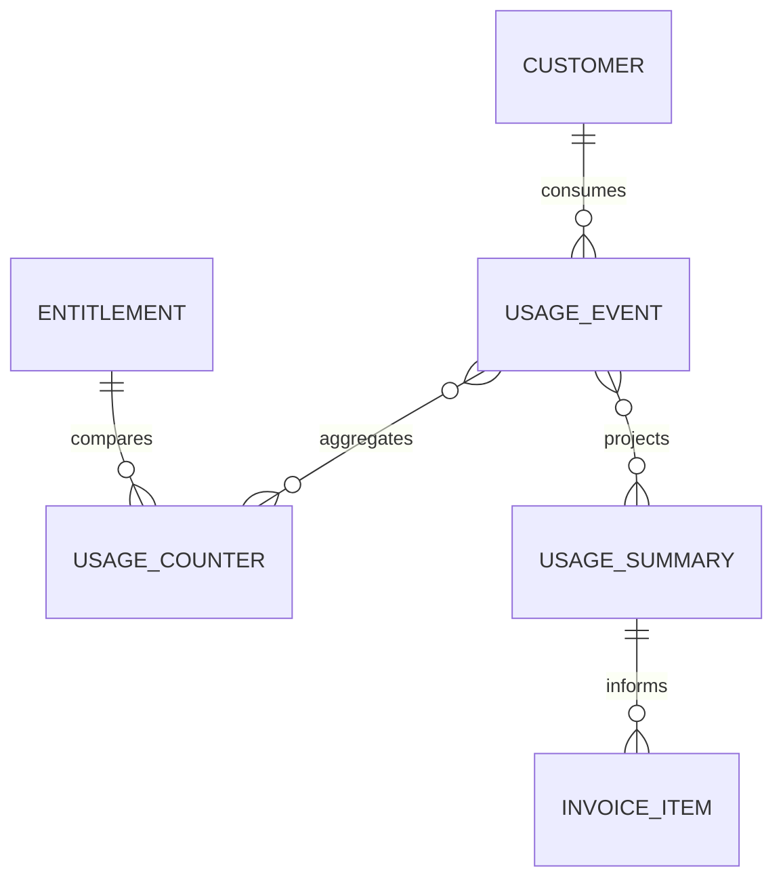
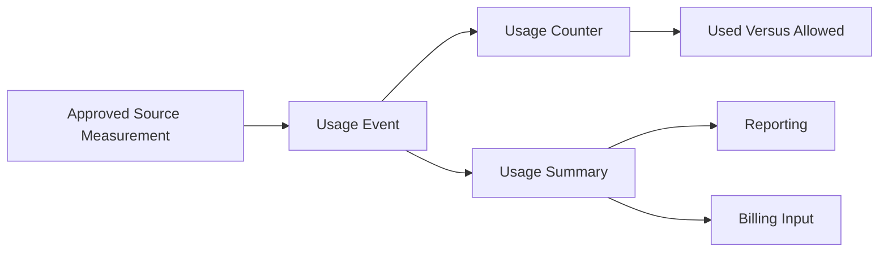

# MIỀN NGHIỆP VỤ SAAS MỨC SỬ DỤNG

Miền nghiệp vụ SaaS Mức sử dụng đo lường lượng tài nguyên LearnForge mà mỗi
Khách hàng đã tiêu thụ. Miền nghiệp vụ này lưu giữ các phép đo chỉ ghi nối tiếp
và xây dựng bộ đếm hiện tại cùng bản tổng hợp có Phiên bản phục vụ báo cáo, so
sánh hạn mức và Thanh toán mà không sở hữu Quyền sử dụng hoặc khoản phí.

---

## Tổng quan Miền nghiệp vụ

- **Trách nhiệm nghiệp vụ:** Ghi nhận và tổng hợp mức tiêu thụ tài nguyên được
  biểu thị bằng “Đã sử dụng.”.
- **Phạm vi:** Sự kiện Mức sử dụng, bộ đếm tích lũy và bản tổng hợp phục vụ báo
  cáo hoặc Thanh toán.
- **Sở hữu:** Phép đo Mức sử dụng thô và mô hình chiếu dẫn xuất từ Mức sử dụng.
- **Không sở hữu:** Khách hàng, Đăng ký dịch vụ, Quyền sử dụng, giới hạn được
  phép, tính giá, Hóa đơn, Thanh toán, sự kiện Theo dõi, lần chạy mô hình AI
  hoặc trạng thái của miền nghiệp vụ nguồn.
- **Miền nghiệp vụ liên quan:** Tenant, Thương mại, Thanh toán, AI, Media,
  LiveClass, Theo dõi và các nguồn phép đo đã được phê duyệt khác.

---

## Các nhóm cơ sở dữ liệu

## 1. Đo lường Mức sử dụng

| Bảng | Mô tả |
|------|------|
| saas_usage_events | Phép đo mức tiêu thụ tài nguyên chỉ ghi nối tiếp |

---

## 2. Mô hình chiếu Mức sử dụng

| Bảng | Mô tả |
|------|------|
| saas_usage_counters | Mô hình chiếu mức sử dụng tích lũy hiện tại |
| saas_usage_summaries | Bản tổng hợp có Phiên bản cho báo cáo và Thanh toán |

---

## Sơ đồ quan hệ Miền nghiệp vụ

---

## Luồng nghiệp vụ

---

## Quan hệ liên Miền nghiệp vụ

Mức sử dụng → Tenant để lấy định danh Khách hàng và bảo đảm cô lập  
Mức sử dụng → Thương mại để lấy ngữ cảnh Đăng ký dịch vụ và Quyền sử dụng  
Mức sử dụng → Thanh toán để cung cấp bản tổng hợp Mức sử dụng đã được phê duyệt  
Mức sử dụng → AI để nhận phép đo thực thi đã được phê duyệt  
Mức sử dụng → Media và LiveClass để nhận phép đo tài nguyên đã được phê duyệt  
Mức sử dụng → Theo dõi chỉ thông qua ánh xạ phép đo rõ ràng

---

## Nguyên tắc thiết kế

- Mức sử dụng chỉ trả lời “Đã sử dụng.”.
- Sự kiện Mức sử dụng là Nguồn dữ liệu chuẩn của phép đo.
- Sự kiện Mức sử dụng chỉ được ghi nối tiếp.
- Bộ đếm và bản tổng hợp là các mô hình chiếu có thể tái tạo.
- Mô hình chiếu không bao giờ ghi ngược vào lịch sử phép đo.
- Hợp đồng chỉ số phải rõ ràng và ổn định.
- Hạn mức được phép vẫn thuộc quyền sở hữu dữ liệu của Quyền sử dụng Thương mại.
- Tính giá, Hóa đơn và Thanh toán vẫn thuộc quyền sở hữu của Miền nghiệp vụ
  Thanh toán.
- Sự kiện Mức sử dụng không thay thế sự kiện Theo dõi hoặc bản ghi của miền
  nghiệp vụ nguồn.
- Mọi phép đo Mức sử dụng đều được cô lập theo tenant.
