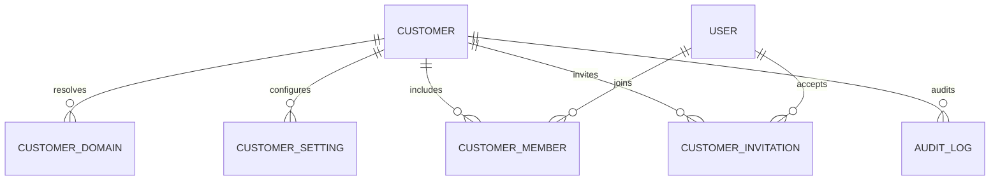
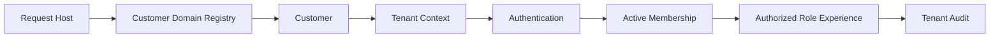

# MIỀN NGHIỆP VỤ SAAS TENANT

Miền nghiệp vụ SaaS Tenant là nền tảng đa tenant của LearnForge. Miền nghiệp vụ
này xác định từng Customer, phân giải miền của yêu cầu, quản lý cấu hình
tenant và tư cách thành viên, kiểm soát vòng đời của lời mời, đồng thời lưu giữ
lịch sử kiểm tra cấp tenant trên một nền tảng dùng chung với trải nghiệm Khách
hàng được cô lập.

---

## Tổng quan Miền nghiệp vụ

- **Trách nhiệm nghiệp vụ:** Thiết lập định danh Customer và ranh giới tenant
  được mọi miền nghiệp vụ phía sau sử dụng.
- **Phạm vi:** Vòng đời Customer, định tuyến miền, thiết lập, tư cách thành
  viên, lời mời và kiểm tra tenant.
- **Sở hữu:** Định danh Customer, cấu hình tenant, ánh xạ miền, tư cách thành
  viên giữa User và Customer, lời mời và lịch sử kiểm tra tenant.
- **Không sở hữu:** Định danh Authentication, trạng thái học tập, kết quả Assessment,
  xử lý Media, đầu ra AI, Subscription, Usage, Hóa đơn hoặc Thanh toán.
- **Miền nghiệp vụ liên quan:** Authentication, User, Commercial, Usage,
  Billing và mọi miền nghiệp vụ LearnForge có phạm vi tenant.

---

## Các nhóm cơ sở dữ liệu

## 1. Định danh Customer

| Bảng | Mô tả |
|------|------|
| **saas_customers** | Định danh gốc và vòng đời của Customer |

---

## 2. Phân giải và cấu hình tenant

| Bảng | Mô tả |
|------|------|
| **saas_customer_domains** | Danh mục đăng ký chuẩn cho miền của yêu cầu |
| **saas_customer_settings** | Các thiết lập cấu hình tenant |

---

## 3. Tư cách thành viên và lời mời

| Bảng | Mô tả |
|------|------|
| **saas_customer_members** | Tư cách thành viên giữa User và Customer |
| **saas_customer_invitations** | Vòng đời lời mời vào tenant |

---

## 4. Kiểm tra tenant

| Bảng | Mô tả |
|------|------|
| **saas_audit_logs** | Lịch sử kiểm tra tenant chỉ ghi nối tiếp |

---

## Sơ đồ quan hệ Miền nghiệp vụ

---

## Luồng nghiệp vụ

---

## Quan hệ liên Miền nghiệp vụ

Tenant → Authentication để thực hiện xác thực nhận biết tenant  
Tenant → User để tham chiếu định danh và hồ sơ  
Tenant → Course, Assessment, LiveClass, Media, Track và AI để bảo đảm cô lập  
Tenant → Commercial để cung cấp ngữ cảnh Subscription của Customer  
Tenant → Usage để xác định quyền sở hữu phép đo theo Customer  
Tenant → Billing để xác định quyền sở hữu tài chính theo Customer

---

## Nguyên tắc thiết kế

- Customer là gốc của quyền sở hữu tenant.
- Tenant được phân giải trước Authentication.
- Hoạt động định tuyến miền sử dụng Danh mục đăng ký miền chuẩn.
- Định danh User và tư cách thành viên của Customer là hai trách nhiệm
  riêng biệt.
- Tư cách thành viên là Nguồn dữ liệu chuẩn cho quan hệ User–Customer.
- Lời mời có vòng đời bảo mật và rõ ràng.
- Thiết lập tenant không thay thế trạng thái có ràng buộc của miền nghiệp vụ.
- Lịch sử kiểm tra là bằng chứng chỉ ghi nối tiếp.
- Không tenant nào được truy cập dữ liệu nghiệp vụ của tenant khác.
- Ngữ cảnh tenant không chuyển quyền sở hữu dữ liệu trạng thái nghiệp vụ phía
  sau.
