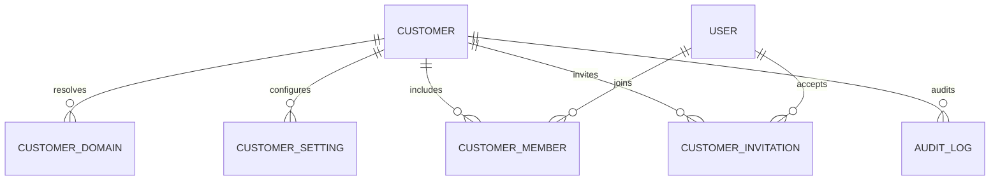
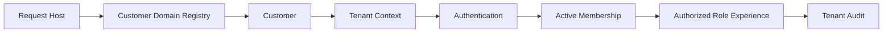

# DOMAIN SAAS TENANT

Domain SaaS Tenant là nền tảng multi-tenant của LearnForge. Domain này xác định
từng Customer, phân giải Domain của request, quản lý cấu hình tenant và
Membership, kiểm soát lifecycle của Invitation, đồng thời lưu giữ lịch sử kiểm
tra cấp tenant trên một nền tảng dùng chung với trải nghiệm Customer được cô
lập.

---

## Tổng quan Domain

- **Trách nhiệm nghiệp vụ:** Thiết lập định danh Customer và ranh giới tenant
  được mọi Domain phía sau sử dụng.
- **Phạm vi:** Lifecycle Customer, định tuyến Domain, Settings, Membership,
  Invitation và kiểm tra tenant.
- **Sở hữu:** Định danh Customer, cấu hình tenant, mapping Domain, Membership
  User–Customer, Invitation và lịch sử kiểm tra tenant.
- **Không sở hữu:** Định danh Authentication, trạng thái học tập, kết quả
  Assessment, xử lý Media, đầu ra AI, Subscription, Usage, Invoice hoặc
  Payment.
- **Domain liên quan:** Auth, User, Commercial, Usage, Billing và mọi Domain
  nghiệp vụ LearnForge có phạm vi tenant.

---

## Các nhóm cơ sở dữ liệu

## 1. Định danh Customer

| Table | Mô tả |
|------|------|
| saas_customers | Định danh gốc và lifecycle của Customer |

---

## 2. Phân giải và cấu hình tenant

| Table | Mô tả |
|------|------|
| saas_customer_domains | Registry chuẩn cho Domain của request |
| saas_customer_settings | Các thiết lập cấu hình tenant |

---

## 3. Membership và Invitation

| Table | Mô tả |
|------|------|
| saas_customer_members | Membership giữa User và Customer |
| saas_customer_invitations | Lifecycle Invitation vào tenant |

---

## 4. Kiểm tra tenant

| Table | Mô tả |
|------|------|
| saas_audit_logs | Lịch sử kiểm tra tenant chỉ ghi nối tiếp |

---

## Sơ đồ quan hệ Domain

---

## Luồng nghiệp vụ

---

## Quan hệ liên Domain

Tenant → Auth để thực hiện Authentication nhận biết tenant  
Tenant → User để tham chiếu định danh và hồ sơ  
Tenant → Course, Assessment, LiveClass, Media, Track và AI để bảo đảm cô lập  
Tenant → Commercial để cung cấp ngữ cảnh Subscription của Customer  
Tenant → Usage để xác định quyền sở hữu phép đo theo Customer  
Tenant → Billing để xác định quyền sở hữu tài chính theo Customer

---

## Nguyên tắc thiết kế

- Customer là gốc của quyền sở hữu tenant.
- Tenant được phân giải trước Authentication.
- Hoạt động định tuyến Domain sử dụng Domain Registry chuẩn.
- Định danh User và Membership của Customer là hai trách nhiệm riêng biệt.
- Membership là Source Of Truth cho quan hệ User–Customer.
- Invitation có lifecycle bảo mật và rõ ràng.
- Tenant Settings không thay thế trạng thái có ràng buộc của Domain.
- Lịch sử kiểm tra là bằng chứng chỉ ghi nối tiếp.
- Không tenant nào được truy cập dữ liệu nghiệp vụ của tenant khác.
- Ngữ cảnh tenant không chuyển quyền sở hữu trạng thái nghiệp vụ phía sau.
