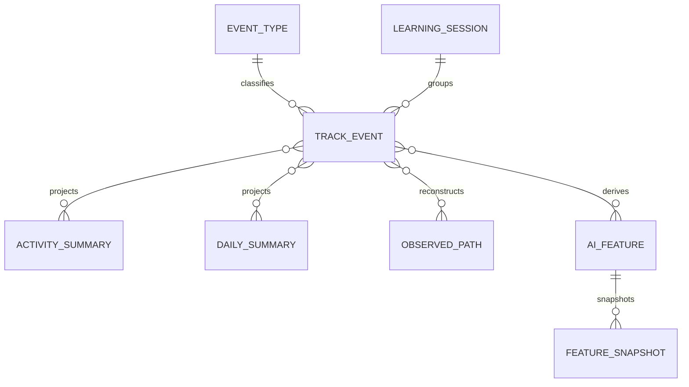
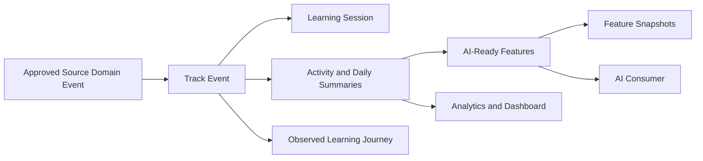

# MIỀN NGHIỆP VỤ TRACK

Document Path: database/track/README.md

> ⚠️ **Chưa triển khai**: Đây là spec kiến trúc đã duyệt (ADR-0005, Frozen)
> nhưng hiện chưa có migration/model thực tế trong codebase — xem
> `database/migrations/` để biết trạng thái triển khai thật.

Miền nghiệp vụ Track ghi nhận hành vi học tập dưới dạng quan sát chỉ ghi nối
tiếp và chuyển lịch sử đó thành dữ liệu phân tích cùng mô hình đọc sẵn sàng cho
AI có thể tái tạo. Miền nghiệp vụ này giải thích quá trình học đã diễn ra như
thế nào mà không thay thế trạng thái Progress, Kết quả, Tham dự hoặc Xử
lý có thẩm quyền do các miền nghiệp vụ nguồn nắm giữ.

---

## Tổng quan Miền nghiệp vụ

- **Trách nhiệm nghiệp vụ:** Lưu giữ lịch sử hành vi học tập và tạo ra các tín
  hiệu phân tích hữu ích.
- **Phạm vi:** Hệ thống phân loại Event, Event hành vi, phiên học tập, bản
  tổng hợp, đặc trưng sẵn sàng cho AI, lịch sử đặc trưng và hành trình quan sát
  được.
- **Sở hữu:** Lịch sử Event Track và các mô hình phân tích dẫn xuất từ
  Track.
- **Không sở hữu:** Progress hoặc Hoàn thành khóa học, kết quả Assessment,
  dữ liệu Tham dự, xử lý Media, Certificate, đề xuất AI, Usage SaaS hoặc
  trạng thái Billing.
- **Miền nghiệp vụ liên quan:** Course, LiveClass, Assessment, Media, Certificate,
  AI, Usage, User và Tenant.

---

## Các nhóm cơ sở dữ liệu

## 1. Hệ thống phân loại và lịch sử Event

| Bảng | Mô tả |
|------|------|
| **track_event_types** | Hệ thống phân loại Event học tập được quản trị |
| **track_events** | Quan sát hành vi chỉ ghi nối tiếp |

---

## 2. Phiên học tập

| Bảng | Mô tả |
|------|------|
| **track_learning_sessions** | Nhóm phiên học tập phục vụ phân tích |

---

## 3. Tổng hợp hành vi

| Bảng | Mô tả |
|------|------|
| **track_activity_summaries** | Tổng hợp hành vi cấp Activity |
| **track_daily_summaries** | Tổng hợp hành vi hằng ngày của học viên |
| **track_learning_paths** | Hành trình học tập quan sát được đã tái dựng |

---

## 4. Đặc trưng sẵn sàng cho AI

| Bảng | Mô tả |
|------|------|
| **track_ai_features** | Đặc trưng hành vi hiện tại sẵn sàng cho AI |
| **track_feature_snapshots** | Snapshot lịch sử của đặc trưng |

---

## Sơ đồ quan hệ Miền nghiệp vụ

---

## Luồng nghiệp vụ

---

## Quan hệ liên Miền nghiệp vụ

Track → Tenant để bảo đảm cô lập  
Track → User để lấy ngữ cảnh học viên  
Track → Course để nhận Event học tập và ngữ cảnh bất biến  
Track → LiveClass để nhận Event tham gia  
Track → Assessment để nhận Event làm bài và chấm điểm  
Track → Media để nhận Event truy cập đã được phê duyệt  
Track → Certificate để nhận Event Certificate đã được phê duyệt  
Track → AI với vai trò cung cấp bản tổng hợp và đặc trưng sẵn sàng cho AI  
Track → Usage chỉ thông qua một hợp đồng phép đo riêng đã được phê duyệt

---

## Nguyên tắc thiết kế

- Event Track là các quan sát chỉ ghi nối tiếp.
- Miền nghiệp vụ nguồn vẫn có thẩm quyền đối với Event nghiệp vụ mà mình phát
  sinh.
- Việc sửa sai bổ sung bằng chứng mới thay vì ghi lại lịch sử.
- Hệ thống phân loại Event được quản trị và ổn định.
- Phiên học tập phục vụ phân tích, không phải phiên xác thực.
- Bản tổng hợp, lộ trình và đặc trưng là các mô hình đọc có thể tái tạo.
- Version của mô hình chiếu bảo toàn khả năng tái lập.
- Track không bao giờ ghi trạng thái nghiệp vụ của miền nghiệp vụ nguồn.
- Dữ liệu hành vi tuân theo chính sách cô lập tenant và quyền riêng tư.
- Event Track và Event Usage SaaS là hai khái niệm riêng biệt.
