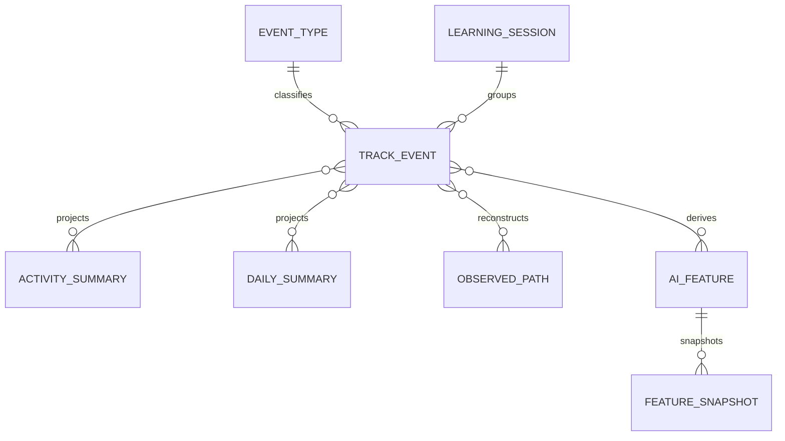
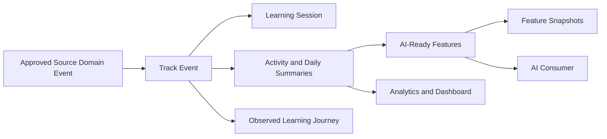

# DOMAIN TRACK

Domain Track ghi nhận hành vi học tập dưới dạng quan sát chỉ ghi nối tiếp và
chuyển lịch sử đó thành dữ liệu Analytics cùng Read Model sẵn sàng cho AI có
thể tái tạo. Domain này giải thích quá trình học đã diễn ra như thế nào mà
không thay thế trạng thái Progress, Result, Attendance hoặc Processing có thẩm
quyền do các Domain nguồn nắm giữ.

---

## Tổng quan Domain

- **Trách nhiệm nghiệp vụ:** Lưu giữ lịch sử hành vi học tập và tạo ra các tín
  hiệu Analytics hữu ích.
- **Phạm vi:** Hệ thống phân loại Event, Event hành vi, Learning Session,
  Summary, Feature sẵn sàng cho AI, lịch sử Feature và hành trình quan sát
  được.
- **Sở hữu:** Lịch sử Track Event và các model phân tích dẫn xuất từ Track.
- **Không sở hữu:** Course Progress hoặc Completion, kết quả Assessment,
  Attendance, xử lý Media, Certificate, AI Recommendation, SaaS Usage hoặc
  trạng thái Billing.
- **Domain liên quan:** Course, LiveClass, Assessment, Media, Certificate, AI,
  Usage, User và Tenant.

---

## Các nhóm cơ sở dữ liệu

## 1. Hệ thống phân loại và lịch sử Event

| Table | Mô tả |
|------|------|
| track_event_types | Hệ thống phân loại Event học tập được quản trị |
| track_events | Quan sát hành vi chỉ ghi nối tiếp |

---

## 2. Learning Session

| Table | Mô tả |
|------|------|
| track_learning_sessions | Nhóm Learning Session phục vụ phân tích |

---

## 3. Tổng hợp hành vi

| Table | Mô tả |
|------|------|
| track_activity_summaries | Tổng hợp hành vi cấp Activity |
| track_daily_summaries | Tổng hợp hành vi hằng ngày của học viên |
| track_learning_paths | Hành trình học tập quan sát được đã tái dựng |

---

## 4. Feature sẵn sàng cho AI

| Table | Mô tả |
|------|------|
| track_ai_features | Feature hành vi hiện tại sẵn sàng cho AI |
| track_feature_snapshots | Snapshot lịch sử của Feature |

---

## Sơ đồ quan hệ Domain

---

## Luồng nghiệp vụ

---

## Quan hệ liên Domain

Track → Tenant để bảo đảm cô lập  
Track → User để lấy ngữ cảnh học viên  
Track → Course để nhận Event học tập và ngữ cảnh bất biến  
Track → LiveClass để nhận Event tham gia  
Track → Assessment để nhận Event Attempt và Grading  
Track → Media để nhận Event truy cập đã được phê duyệt  
Track → Certificate để nhận Event Certificate đã được phê duyệt  
Track → AI với vai trò cung cấp Summary và Feature sẵn sàng cho AI  
Track → Usage chỉ thông qua một Contract phép đo riêng đã được phê duyệt

---

## Nguyên tắc thiết kế

- Track Event là các quan sát chỉ ghi nối tiếp.
- Domain nguồn vẫn có thẩm quyền đối với Event nghiệp vụ mà mình phát sinh.
- Việc sửa sai bổ sung bằng chứng mới thay vì ghi lại lịch sử.
- Hệ thống phân loại Event được quản trị và ổn định.
- Learning Session phục vụ phân tích, không phải Session Authentication.
- Summary, Path và Feature là các Read Model có thể tái tạo.
- Version của Projection bảo toàn khả năng tái lập.
- Track không bao giờ ghi trạng thái nghiệp vụ của Domain nguồn.
- Dữ liệu hành vi tuân theo chính sách cô lập tenant và quyền riêng tư.
- Track Event và SaaS Usage Event là hai khái niệm riêng biệt.
